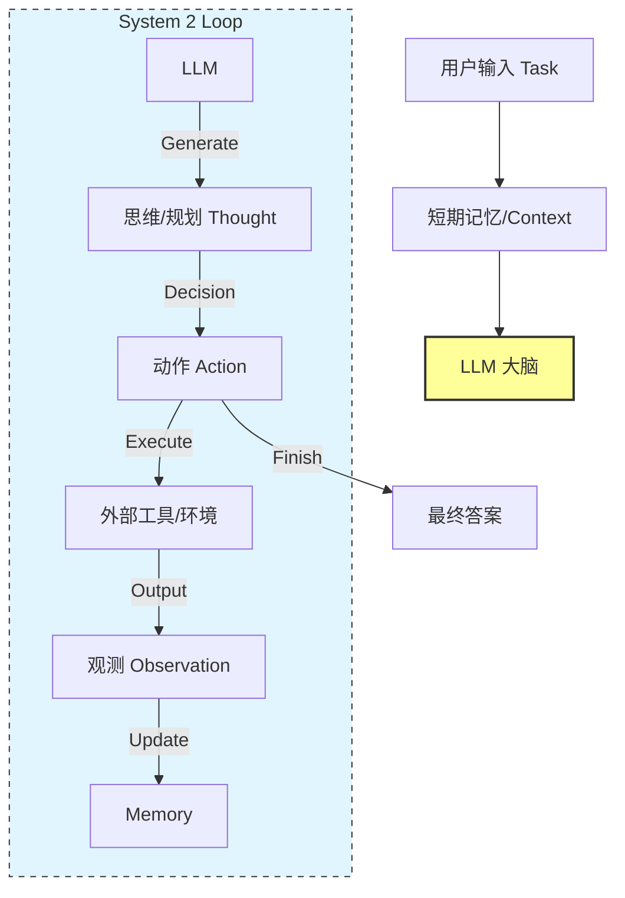

# 第01课：认知架构总论与 System 2

**关键词**：System 1/2, Perception-Action Loop, AutoGPT, BabyAGI, 熵减分析

---

## 笔记区域

你好。这是《AI Agent 深度架构与数学原理》的第一课。

作为研三学生，你应该已经非常熟悉 Transformer 的 `Forward Pass` 是如何计算 Next Token Probability 的。然而，单纯的 LLM 只是一个“概率统计模型”，它没有意图（Intent），没有记忆（Memory），也没有对世界的动态感知。

本节课我们将从**认知科学**与**控制理论**的交叉视角，解构如何将一个静态的 LLM 封装成一个动态的、具备 System 2（慢思考）能力的智能体。

---

# 🧠 第01课：认知架构总论与 System 2

### 0. 背景驱动：从前馈网络到循环系统

* **挑战 (Challenge)**：
  LLM 本质上是一个函数 $P(y|x)$。在标准推理（Zero-shot）中，它的计算深度（Computational Depth）是固定的（由层数决定）。
  **核心问题**：对于复杂任务（如“写一个贪吃蛇游戏”），单纯的 Next Token Prediction 无法进行长程规划（Long-term Planning），且一旦中间步骤出错，模型无法自我纠正（Error Correction），因为它是单向的 DAG（有向无环图）计算。
* **突破点 (Breakthrough)**：
  **认知架构（Cognitive Architecture）**。不仅仅将 LLM 视为模型，而是将其视为 CPU。通过**递归（Recursion）**和**外部记忆（External Memory）**，将单次的推理转化为一个**顺序决策过程（Sequential Decision Process）**。
* **改进方向**：
  从 **System 1 (Fast, Intuitive, Unconscious)** 转向 **System 2 (Slow, Deliberate, Logical)**。

  * *System 1*: `Input -> LLM -> Output` (ChatGPT default behavior)
  * *System 2*: `Input -> [Thought -> Action -> Observation]^N -> Output` (Agentic behavior)

---

### 1. 理论核心：POMDP 与 认知循环

#### 1.1 形式化定义：Agent as a Policy

在数学上，我们将 Agent 建模为运行在 **部分可观测马尔可夫决策过程 (POMDP)** 中的策略函数。

定义元组 $\mathcal{M} = \langle S, A, T, R, \Omega, O, \gamma \rangle$：

* $S$: 环境的真实状态（Latent World State），Agent 无法全知。
* $A$: 动作空间（包含 Text Generation 和 Tool Use）。
* $\Omega$: 观测空间（Context Window 中的内容）。
* $T$: 状态转移 $P(s'|s,a)$。
* $O$: 观测概率 $P(o|s',a)$。

**System 2 的本质**是引入了**内部状态（Internal State）**或**记忆（Memory）** $h_t$。
Agent 的策略 $\pi_\theta$ 不再仅仅依赖当前观测 $o_t$，而是依赖历史轨迹 $\tau_t$：

$$
\tau_t = (o_0, a_0, o_1, a_1, \dots, o_t)
$$

$$
a_t \sim \pi_\theta(a_t | \tau_t)
$$

#### 1.2 感知-行动循环 (Perception-Action Loop)

Lilian Weng 在其经典博文中提出的架构，本质上是对人类认知循环（OODA Loop: Observe-Orient-Decide-Act）的工程映射：

1. **Perception (感知)**: 将环境反馈 $o_t$ 编码进 Context。
2. **Memory (记忆)**:
   * *Short-term*: Context Window。
   * *Long-term*: Vector Database (RAG)。
3. **Planning (规划 - System 2 的核心)**:
   * *Decomposition*: $Goal \to \{Subgoal_1, Subgoal_2\}$.
   * *Reflection*: 检查 $a_{t-1}$ 是否导致了预期的结果。
4. **Action (行动)**: 执行 API 调用或文本输出。

---

### 2. 架构解剖：ReAct 与 认知数据流

我们以最经典的 **ReAct (Reasoning + Acting)** 架构为例，这是实现 System 2 的基石。

#### 2.1 系统设计图 (Mermaid)



#### 2.2 数据流解析

在 ReAct 模式中，Prompt 不再是一个简单的 Question，而是一个动态增长的**轨迹（Trajectory）**。

* **输入 $x$**: "分析 AAPL 股价并给出投资建议。"
* **Step 1**:
  * Context: `Question: x`
  * LLM Output: `Thought: 需要获取实时数据。 Action: Search("AAPL stock price")`
* **Step 2** (Environment Execution):
  * Context Update: `Question: x... Action: Search... Observation: 185.3 USD...`
  * LLM Output: `Thought: 价格处于高位，需要看 P/E ratio。 Action: Search("AAPL PE ratio")`
* **Step N**:
  * ...
  * LLM Output: `Thought: 信息足够。 Final Answer: 建议持有...`

---

### 3. Paper Driven：核心论文与贡献

#### 3.1 ReAct: Synergizing Reasoning and Acting in Language Models (ICLR 2023)

* **核心贡献**: 解决了 CoT (Chain-of-Thought) 的幻觉问题和单纯 Action 的无脑执行问题。
* **方法论**: 强制模型在执行 Action 之前生成 Thought。
  * 只有 Thought (CoT): 容易产生事实幻觉，无法获取外部新知。
  * 只有 Action: 缺乏推理，难以处理多步依赖任务。
  * **ReAct**: Thought $\leftrightarrow$ Action 的交错。

#### 3.2 Reflexion: Language Agents with Verbal Reinforcement Learning (NeurIPS 2023)

* **挑战**: ReAct 如果第一步走错了，容易陷入死循环或错误累积。
* **核心贡献**: 引入 **Evaluator** 和 **Self-Reflection**。
* **机制**:
  Agent 产生轨迹 $\tau$ -> Evaluator 评分 $r$ -> 如果失败，LLM 生成一段“反思” (Self-Reflection) 存入 Memory -> 下一次尝试时，将反思作为 Context 输入，避免重蹈覆辙。
  这本质上是 **In-context Reinforcement Learning**。

---

### 4. Code & Engineering：构建一个最小化的 System 2 Agent

我们不使用 LangChain，而是用原生 Python 实现一个具备 **Loop** 和 **Stop Condition** 的 Agent，以理解其控制流。

```python
import openai
import re

class System2Agent:
    def __init__(self, system_prompt, tools):
        self.system_prompt = system_prompt
        self.tools = tools # Dict of functions
        self.history = []  # Short-term memory (Context)
        self.max_steps = 10

    def run(self, user_query):
        # 初始化状态
        self.history = [{"role": "system", "content": self.system_prompt}]
        self.history.append({"role": "user", "content": user_query})
      
        step = 0
        while step < self.max_steps:
            print(f"--- Step {step} ---")
          
            # 1. Perception & Planning (LLM Inference)
            response = self._call_llm()
            print(f"Agent: {response}")
            self.history.append({"role": "assistant", "content": response})
          
            # 2. Action Parsing
            # 假设 ReAct 格式: "Thought: ... Action: tool_name(args)"
            thought, action_name, action_args = self._parse_output(response)
          
            # 3. Stop Condition
            if action_name == "Final Answer":
                return action_args
          
            # 4. Execution (Interacting with Environment)
            observation = self._execute_tool(action_name, action_args)
            print(f"Env: {observation}")
          
            # 5. Observation Feedback (Updating Memory)
            obs_message = f"Observation: {observation}"
            self.history.append({"role": "user", "content": obs_message})
          
            step += 1
          
        return "Task failed: Max steps reached."

    def _call_llm(self):
        # 实际工程中这里需要处理 Retry, Timeout, Context Limit
        completion = openai.chat.completions.create(
            model="gpt-4",
            messages=self.history,
            stop=["Observation:"] # 关键：防止模型自问自答，生成幻觉观测
        )
        return completion.choices[0].message.content

    def _parse_output(self, text):
        # 简单的正则解析
        action_match = re.search(r"Action:\s*(\w+)\((.*)\)", text)
        if "Final Answer:" in text:
            return None, "Final Answer", text.split("Final Answer:")[1].strip()
        if action_match:
            return None, action_match.group(1), action_match.group(2)
        return None, "None", "No action found"

    def _execute_tool(self, name, args):
        if name in self.tools:
            try:
                return self.tools[name](args)
            except Exception as e:
                return f"Error: {str(e)}"
        return "Error: Tool not found."

# --- Usage Example ---
def search_tool(query):
    return "AAPL price is 150 USD."

tools = {"search": search_tool}
prompt = """
Answer the following questions as best you can. You have access to the following tools:
search(query): useful for when you need to answer questions about current events.

Use the following format:
Question: the input question you must answer
Thought: you should always think about what to do
Action: the action to take, should be one of [search]
Observation: the result of the action
... (this Thought/Action/Observation can repeat N times)
Thought: I now know the final answer
Final Answer: the final answer to the original input question
"""

agent = System2Agent(prompt, tools)
result = agent.run("What is AAPL price?")
print(f"Result: {result}")
```

### 5. 工程应用：输入输出与操作流

**场景**：企业级数据分析 Agent。

1. **Input (给大模型输入什么)**:

   * `System Prompt`: 定义人设、工具Schema（如 SQL执行器）、安全限制（只读权限）。
   * `Trajectory`: 历史对话 + 当前的 "Observation"（如数据库返回的 Schema 或 错误信息）。
   * *Prompt Engineering Tip*: 在 System Prompt 中加入 "Few-shot Examples"（示例），展示正确的 ReAct 格式，这对模型遵循指令至关重要。
2. **Output (模型输出什么)**:

   * 一段文本，包含自然语言的思考 (`Thought`) 和结构化的指令 (`Action`).
   * 例如：`Thought: I need to query the sales table. Action: execute_sql("SELECT * FROM sales LIMIT 5")`
3. **后续操作 (Processing)**:

   * **Parser**: 提取 `execute_sql` 和 SQL 语句。
   * **Validator**: **关键步骤**。检查 SQL 是否有注入风险？是否符合语法？
   * **Executor**: 在沙箱环境中执行 SQL。
   * **Feedback**: 将结果（如 dataframe 的 markdown 形式或 error message）截断（防止爆 Context）后拼接到 Prompt 中。
4. **最终结果**:

   * Agent 经过多次循环，最终输出 `Final Answer: Based on the data, the sales increased by 20%...`。

---

### 6. Critical Thinking：批判性分析

作为架构师，必须看到 System 2 的代价：

1. **Latency (延迟)**:

   * ReAct 是串行的。如果解决一个问题需要 5 步，意味着 5 次 LLM Round-trip。对于实时交互应用，这通常是不可接受的（User Experience Issue）。
   * *解决思路*: **Parallel Execution** (如使用 DAG 规划而非线性链) 或 **Speculative Decoding**。
2. **Cost (成本)**:

   * Input Context 随着 Step 增加呈线性增长。Step 10 的时候，你可能在重复输入 Step 1-9 的所有 Token。这会导致 API 成本指数级上升。
   * *解决思路*: **Memory Summarization** (每隔几步总结历史) 或 **Infinite Context** 技术。
3. **Context Window & Lost in the Middle**:

   * 当轨迹过长，模型容易忘记最初的 Goal 或中间的约束。
   * *解决思路*: 引入独立的 **Planner Agent** 维护高层目标，Worker Agent 只关注当前 Step。
4. **Loop Stability (死循环)**:

   * 模型可能会陷入 `Search -> Error -> Search -> Error` 的死循环。
   * *解决思路*: 工程上必须设置 `max_retries` 和检测重复 Action 的 Heuristic 规则。

---

### 7. 前沿扩展

* **System 2 + Knowledge Graph**:
  单纯的 ReAct 依赖 LLM 内部参数知识。结合 KG，Agent 可以在 Graph 上进行多跳推理（Multi-hop Reasoning），每一步 Action 变成在 KG 上游走（Walk）。
* **Multimodal Agents (Vision)**:
  观测空间 $\Omega$ 扩展为图像。例如 **AppAgent**，它的 Observation 是手机屏幕截图，Action 是 (x,y) 点击坐标。架构逻辑不变，但 Encoder 变成了 Vision Transformer。

---

这就是第一课的核心内容。我们建立了 Agent 的骨架：**通过循环和记忆，将无状态的 LLM 变成了有状态的 System 2 推理机**。

下一课，我们将深入解剖 Agent 的“四肢”——**工具使用与规划算法**，探讨如何让 LLM 精确控制外部世界。

<style>#mermaid-1768967404020{font-family:sans-serif;font-size:16px;fill:#333;}#mermaid-1768967404020 .error-icon{fill:#552222;}#mermaid-1768967404020 .error-text{fill:#552222;stroke:#552222;}#mermaid-1768967404020 .edge-thickness-normal{stroke-width:2px;}#mermaid-1768967404020 .edge-thickness-thick{stroke-width:3.5px;}#mermaid-1768967404020 .edge-pattern-solid{stroke-dasharray:0;}#mermaid-1768967404020 .edge-pattern-dashed{stroke-dasharray:3;}#mermaid-1768967404020 .edge-pattern-dotted{stroke-dasharray:2;}#mermaid-1768967404020 .marker{fill:#333333;}#mermaid-1768967404020 .marker.cross{stroke:#333333;}#mermaid-1768967404020 svg{font-family:sans-serif;font-size:16px;}#mermaid-1768967404020 .label{font-family:sans-serif;color:#333;}#mermaid-1768967404020 .label text{fill:#333;}#mermaid-1768967404020 .node rect,#mermaid-1768967404020 .node circle,#mermaid-1768967404020 .node ellipse,#mermaid-1768967404020 .node polygon,#mermaid-1768967404020 .node path{fill:#ECECFF;stroke:#9370DB;stroke-width:1px;}#mermaid-1768967404020 .node .label{text-align:center;}#mermaid-1768967404020 .node.clickable{cursor:pointer;}#mermaid-1768967404020 .arrowheadPath{fill:#333333;}#mermaid-1768967404020 .edgePath .path{stroke:#333333;stroke-width:1.5px;}#mermaid-1768967404020 .flowchart-link{stroke:#333333;fill:none;}#mermaid-1768967404020 .edgeLabel{background-color:#e8e8e8;text-align:center;}#mermaid-1768967404020 .edgeLabel rect{opacity:0.5;background-color:#e8e8e8;fill:#e8e8e8;}#mermaid-1768967404020 .cluster rect{fill:#ffffde;stroke:#aaaa33;stroke-width:1px;}#mermaid-1768967404020 .cluster text{fill:#333;}#mermaid-1768967404020 div.mermaidTooltip{position:absolute;text-align:center;max-width:200px;padding:2px;font-family:sans-serif;font-size:12px;background:hsl(80,100%,96.2745098039%);border:1px solid #aaaa33;border-radius:2px;pointer-events:none;z-index:100;}#mermaid-1768967404020:root{--mermaid-font-family:sans-serif;}#mermaid-1768967404020:root{--mermaid-alt-font-family:sans-serif;}#mermaid-1768967404020 flowchart{fill:apa;}</style>
