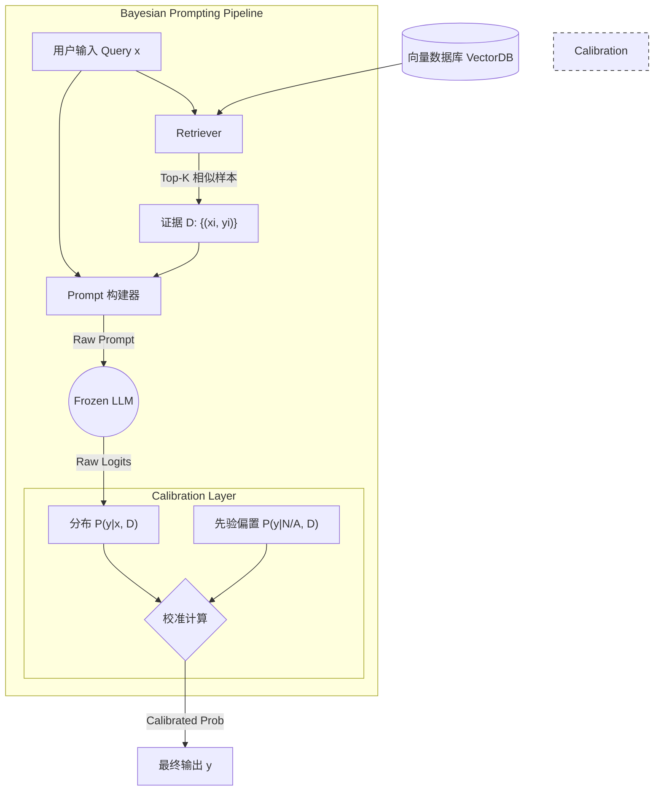

# 第02课：提示工程的贝叶斯视角

**关键词**：Bayesian, ICL (In-Context Learning), 隐式梯度下降, Label Space, Input Space

---

## 笔记区域

你好。这是《AI Agent 深度架构与数学原理》的第二课。

在上节课中，我们讨论了 System 2 的宏观架构。今天，我们将显微镜对准 Agent 与 LLM 交互的最基础接口——**Prompt**。

作为研三学生，你应该有过这种困惑：为什么改变 Prompt 中的一个词，或者改变 Few-shot 示例的顺序，模型的性能会剧烈波动？如果不理解其背后的数学原理，Prompt Engineering 就永远是“炼丹”和“玄学”。

本节课我们将从**概率图模型（Probabilistic Graphical Models）**和**贝叶斯推断**的视角，通过严谨的数学定义来解构 In-Context Learning (ICL)。

---

# 🧠 第02课：提示工程的贝叶斯视角 (The Bayesian Perspective of Prompting)

### 0. 背景驱动：从“炼丹”到“推断”

* **挑战 (Challenge)**：
  LLM 对 Prompt 的格式、示例顺序（Ordering）、示例标签分布（Label Distribution）极其敏感。例如，GPT-3 在某些任务上，仅改变示例顺序，准确率波动可达 50% 以上。这种**不稳定性**是构建鲁棒 Agent 的最大障碍。
* **核心问题**：
  我们通常将 LLM 视为函数 $f(x)$，试图通过调整输入 $x$ 来拟合输出。但实际上，预训练模型是一个巨大的**联合概率分布**。ICL 的过程并不是“梯度下降学习”，而是**在隐空间中的定位**。
* **突破点 (Breakthrough)**：
  **Xie et al. (2022)** 和 **Min et al. (2022)** 等研究提出，ICL 本质上是**隐式贝叶斯推断（Implicit Bayesian Inference）**。
* **改进方向**：
  不再盲目尝试 Prompt，而是通过**证据最大化（Evidence Maximization）**和**后验校准（Posterior Calibration）**来设计 Prompt 系统。

---

### 1. 理论核心：隐潜变量与后验概率

#### 1.1 数学定义：潜在概念模型 (Latent Concept Model)

在贝叶斯视角下，预训练模型不仅仅学习了 $P(\text{next token})$，而是学习了海量的**潜在概念（Latent Concepts）**，我们将这个潜在变量记为 $\theta$。

当我们在 Prompt 中提供示例（Demonstrations） $D = \{(x_1, y_1), ..., (x_k, y_k)\}$ 时，我们的目标是计算预测分布 $P(y|x, D)$。根据全概率公式，这可以分解为：

$$
P(y|x, D) = \int_{\Theta} \underbrace{P(y|x, \theta)}_{\text{Execution}} \cdot \underbrace{P(\theta|D, x)}_{\text{Locating}} \, d\theta
$$

这里包含两个关键过程：

1. **$P(\theta|D, x)$ - 任务定位 (Task Location)**：
   这是 Prompt 的核心作用。Prompt $D$ 不是为了让模型学习 $x \to y$ 的映射（模型不需要这几个样本来学习语法或逻辑），而是为了**缩减潜在概念 $\theta$ 的不确定性**（降低熵）。
   * $D$ 就像是一个搜索查询，在模型的参数空间中检索出最匹配的 $\theta$（例如：“情感分析”任务或“代码翻译”任务）。
2. **$P(y|x, \theta)$ - 任务执行 (Task Execution)**：
   一旦 $\theta$ 被确定（后验分布塌缩为尖峰），模型利用预训练的知识在 $\theta$ 的指导下处理 $x$。

#### 1.2 为什么随机标签也有效？

**Min et al. (2022)** 在论文 *Rethinking the Role of Demonstrations* 中发现一个反直觉现象：**即使将 Few-shot 示例中的标签 $y_i$ 随机打乱（即提供错误的示例），模型的性能下降也非常微弱。**

**贝叶斯解释**：
Prompt $D$ 的主要贡献在于 $P(x_{demo})$ 和 $Format(D)$，它们极大地帮助模型定位了**输入分布**和**输出格式**（即 $\theta$ 的大致区域）。而 $x \to y$ 的具体映射关系，模型早已在预训练中习得，不需要依赖这几个 Few-shot 来学习。
这证明了 ICL 主要是**任务识别（Task Recognition）**而非任务学习。

---

### 2. 架构解剖：基于贝叶斯的 Prompt 优化流水线

在工程落地中，我们利用上述理论构建一个**检索-构建-校准**的闭环系统。

#### 2.1 系统设计图 (Mermaid)



#### 2.2 关键步骤解析

1. **证据检索 (Evidence Retrieval)**：
   * 为了最大化 $P(\theta|D)$，我们需要 $D$ 与 $x$ 尽可能相关。使用 KNN 从训练库中检索 Top-K 样本作为 Few-shot，这比随机采样能显著提升后验概率的准确性。
2. **先验偏置计算 (Prior Bias Calculation)**：
   * 模型往往存在 **Majority Label Bias**（倾向训练集常见词）和 **Recency Bias**（倾向 Prompt 末尾词）。
   * 我们需要计算 $P(y|\text{"N/A"}, D)$，即给模型一个空输入 "N/A"，看它在仅有 Prompt $D$ 的情况下倾向于输出什么。
3. **校准 (Calibration)**：
   * 利用仿射变换或 PMI（互信息）方法，从原始 Logits 中减去先验偏置。

---

### 3. Code & Engineering：实现 Contextual Calibration

我们将实现 **Zhao et al. (2021)** 提出的 **"Calibrate Before Use"** 算法。这是 Prompt Engineering 领域将数学原理转化为工程代码的典范。

**核心逻辑**：
修正后的分数 $Score(y) \propto P(y|x, D) / P(y|\text{"N/A"}, D)$。
在对数空间中：$\log \tilde{P}(y) = \log P(y|x, D) - \log P(y|\text{"N/A"}, D)$。

```python
import torch
import torch.nn.functional as F
from transformers import AutoModelForCausalLM, AutoTokenizer

class BayesianCalibrator:
    def __init__(self, model_name="gpt2"):
        # 在实际 Agent 中，通常使用 llama3-8b 或 mistral
        self.device = "cuda" if torch.cuda.is_available() else "cpu"
        self.tokenizer = AutoTokenizer.from_pretrained(model_name)
        self.model = AutoModelForCausalLM.from_pretrained(model_name).to(self.device)
        self.model.eval()

    def get_logits(self, prompt: str):
        """获取模型输出的原始 Logits"""
        inputs = self.tokenizer(prompt, return_tensors="pt").to(self.device)
        with torch.no_grad():
            outputs = self.model(**inputs)
        # 取最后一个 token 的 logits，代表对下一个词的预测
        return outputs.logits[0, -1, :]

    def calibrate_inference(self, few_shot_prompt: str, user_query: str, candidate_labels: list):
        """
        输入:
            few_shot_prompt: 包含示例的 Prompt 模板
            user_query: 当前用户问题
            candidate_labels: 候选标签列表 (e.g., ["Positive", "Negative"])
        输出:
            校准后的标签及其概率
        """
        # 1. 获取候选标签的 Token ID
        label_ids = [self.tokenizer.encode(l)[0] for l in candidate_labels] # 简化假设标签为单token
      
        # 2. 计算 Contextual Prior (Bias) - 输入为 "N/A"
        # 这一步计算 P(y | N/A, D)，即模型的固有偏见
        content_free_input = "N/A" 
        prior_prompt = f"{few_shot_prompt}\nInput: {content_free_input}\nOutput:"
        prior_logits = self.get_logits(prior_prompt)
        prior_scores = prior_logits[label_ids]
      
        # 3. 计算 True Posterior - 输入为 user_query
        # 这一步计算 P(y | x, D)
        actual_prompt = f"{few_shot_prompt}\nInput: {user_query}\nOutput:"
        posterior_logits = self.get_logits(actual_prompt)
        posterior_scores = posterior_logits[label_ids]
      
        # 4. 执行校准 (Calibration)
        # W矩阵在这里简化为单位矩阵，采用减法（对数除法）消除偏置
        # Calibrated Score = Posterior - Prior
        calibrated_scores = posterior_scores - prior_scores
      
        # 5. 归一化为概率
        probs = F.softmax(calibrated_scores, dim=0)
      
        # 格式化输出
        result = {label: prob.item() for label, prob in zip(candidate_labels, probs)}
        best_label = candidate_labels[torch.argmax(probs).item()]
      
        return best_label, result

# --- Engineering Mockup ---
# 在实际工程中，Prompt 模板通常由 Retriever 动态构建
prompt_template = """
Input: The movie was amazing.
Output: Positive
Input: I waste my time.
Output: Negative
"""

# calibrator = BayesianCalibrator()
# label, probs = calibrator.calibrate_inference(prompt_template, "It's okay I guess.", ["Positive", "Negative"])
# print(f"Prediction: {label}, Probability: {probs}")
```

---

### 4. Paper Driven：核心论文与贡献

1. **Xie, S. M., et al. (2022). *An Explanation of In-Context Learning as Implicit Bayesian Inference*. (ICLR 2022)**
   * **贡献**：建立了 ICL 的理论框架。证明了当预训练数据分布可以被建模为隐马尔可夫模型（HMM）的混合时，ICL 过程在数学上等价于推断 HMM 的潜在概念。
2. **Min, S., et al. (2022). *Rethinking the Role of Demonstrations: What Makes In-Context Learning Work?*. (EMNLP 2022)**
   * **贡献**：通过大量消融实验（Ablation Study）证明：输入分布 $P(x)$ 和标签空间 $P(y)$ 远比输入-标签映射 $P(y|x)$ 重要。这为 Prompt Engineering 提供了“形式重于内容”的指导原则。
3. **Zhao, T., et al. (2021). *Calibrate Before Use: Improving Few-Shot Performance of Language Models*. (ICML 2021)**
   * **贡献**：发现了 LLM 的 Logits 存在严重的偏差，并提出了 Contextual Calibration（即上述代码实现的方法），在不重新训练模型的情况下显著提升了 Few-shot 性能。

---

### 5. Critical Thinking：批判性分析

* **Context Window 瓶颈**：
  贝叶斯理论暗示证据 $D$ 越多，后验越准。但 Context Window 是有限的，且 Transformer 的 Attention 开销是 $O(L^2)$。

  * *SOTA 方案*：**LLMLingua** (EMNLP 2023) 利用小模型计算 Token 的困惑度（Perplexity），压缩 Prompt 中的低信息量 Token，从而在有限窗口内塞入更多 Evidence。
* **Prompt 搜索的算力成本**：
  手动寻找最佳 Prompt 类似于在离散空间进行梯度下降，效率极低。

  * *解决思路*：**DSPy (Stanford)** 或 **APE (Automatic Prompt Engineer)**。将 Prompt 视为可优化的参数，利用 LLM 本身作为优化器（Optimizer），通过迭代生成和评估来自动搜索最佳 Prompt。
* **Latent Variable 的多峰性**：
  如果 Prompt 中的示例由多个不同任务混合而成（例如既有翻译又有摘要），后验分布 $P(\theta|D)$ 可能会出现多峰（Multi-modal），导致模型困惑。

  * *工程约束*：务必保持 Retriever 检索出的示例在语义和格式上的**一致性（Consistency）**。

---

### 6. 前沿扩展

* **Active Prompting**:
  借鉴主动学习（Active Learning）。Agent 首先尝试解决问题，计算输出的不确定性（Uncertainty，例如 Entropy）。对于高不确定性的问题，Agent 主动请求人类标注，并将该样本加入 Prompt $D$。这是一种**人在回路（Human-in-the-loop）的贝叶斯优化**。
* **Prompt as Program**:
  随着 CoT 的发展，Prompt 不再只是文本，而是包含逻辑控制流（If-Else）。贝叶斯视角扩展为**概率编程（Probabilistic Programming）**，Agent 的执行过程变成了在概率图上的采样过程。

---

**总结**：
Prompt Engineering 不是玄学，它是**在预训练参数定义的流形上进行贝叶斯定位**。
在工程实现中，不要只关注 Prompt 写得“好不好看”，通过 **Retriever 优化证据质量**，通过 **Calibrator 修正先验偏置**，才是构建 Robust Agent 的正道。

下一课，我们将深入 Agent 的“思维链条”，探讨 **ReAct 范式与思维链（Chain-of-Thought）的底层机制**。

<style>#mermaid-1768965539700{font-family:sans-serif;font-size:16px;fill:#333;}#mermaid-1768965539700 .error-icon{fill:#552222;}#mermaid-1768965539700 .error-text{fill:#552222;stroke:#552222;}#mermaid-1768965539700 .edge-thickness-normal{stroke-width:2px;}#mermaid-1768965539700 .edge-thickness-thick{stroke-width:3.5px;}#mermaid-1768965539700 .edge-pattern-solid{stroke-dasharray:0;}#mermaid-1768965539700 .edge-pattern-dashed{stroke-dasharray:3;}#mermaid-1768965539700 .edge-pattern-dotted{stroke-dasharray:2;}#mermaid-1768965539700 .marker{fill:#333333;}#mermaid-1768965539700 .marker.cross{stroke:#333333;}#mermaid-1768965539700 svg{font-family:sans-serif;font-size:16px;}#mermaid-1768965539700 .label{font-family:sans-serif;color:#333;}#mermaid-1768965539700 .label text{fill:#333;}#mermaid-1768965539700 .node rect,#mermaid-1768965539700 .node circle,#mermaid-1768965539700 .node ellipse,#mermaid-1768965539700 .node polygon,#mermaid-1768965539700 .node path{fill:#ECECFF;stroke:#9370DB;stroke-width:1px;}#mermaid-1768965539700 .node .label{text-align:center;}#mermaid-1768965539700 .node.clickable{cursor:pointer;}#mermaid-1768965539700 .arrowheadPath{fill:#333333;}#mermaid-1768965539700 .edgePath .path{stroke:#333333;stroke-width:1.5px;}#mermaid-1768965539700 .flowchart-link{stroke:#333333;fill:none;}#mermaid-1768965539700 .edgeLabel{background-color:#e8e8e8;text-align:center;}#mermaid-1768965539700 .edgeLabel rect{opacity:0.5;background-color:#e8e8e8;fill:#e8e8e8;}#mermaid-1768965539700 .cluster rect{fill:#ffffde;stroke:#aaaa33;stroke-width:1px;}#mermaid-1768965539700 .cluster text{fill:#333;}#mermaid-1768965539700 div.mermaidTooltip{position:absolute;text-align:center;max-width:200px;padding:2px;font-family:sans-serif;font-size:12px;background:hsl(80,100%,96.2745098039%);border:1px solid #aaaa33;border-radius:2px;pointer-events:none;z-index:100;}#mermaid-1768965539700:root{--mermaid-font-family:sans-serif;}#mermaid-1768965539700:root{--mermaid-alt-font-family:sans-serif;}#mermaid-1768965539700 flowchart{fill:apa;}</style>
