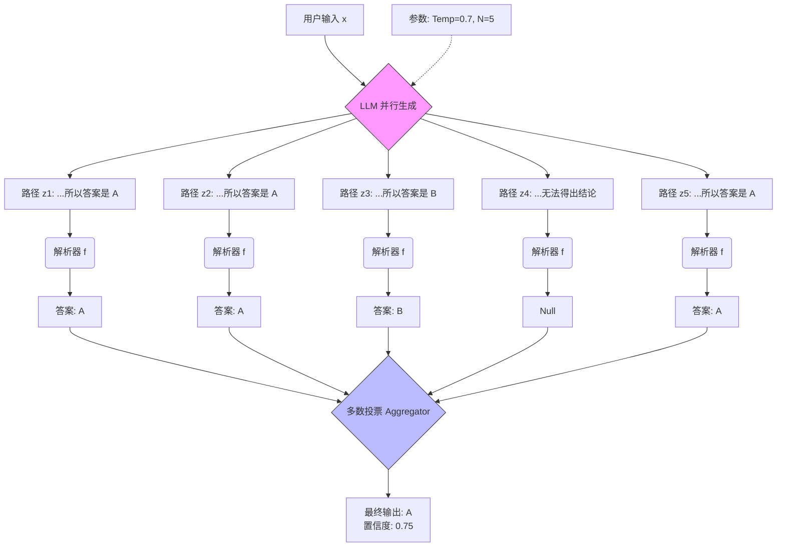

# 第03课：思维链 (CoT) 与自洽性

**关键词**：CoT, CoT-SC, Self-Consistency, Majority Voting, 概率增益推导

---

## 笔记区域


你好。这是《AI Agent 深度架构与数学原理》的第三课。

在前两课中，我们分别探讨了 Agent 的宏观认知架构（System 1 vs System 2）以及 Prompt 的贝叶斯本质。
今天，我们将核心聚焦于 **“推理（Reasoning）”** 的具体实现形态。

### 0. 背景驱动：从映射到推演 (The Context)

* **挑战 (Challenge)**：
  传统的 LLM（如 GPT-3 早期版本）在处理算术推理（Arithmetic Reasoning）、符号逻辑（Symbolic Logic）或常识推理（Commonsense Reasoning）任务时表现糟糕。
  本质原因是：标准 Prompting 试图让模型学习直接从问题空间 $X$ 映射到答案空间 $Y$ 的函数 $f: X \to Y$。对于复杂问题，这个映射是非线性的、高度不连续的，模型很难通过单步生成拟合。
* **突破点 (Breakthrough)**：
  **思维链 (Chain-of-Thought, CoT)** 的出现（Wei et al., 2022）是一个范式转移。它不再强求直接映射，而是引入了一系列**中间潜变量 (Latent Variables)** $Z$。
  **自洽性 (Self-Consistency)**（Wang et al., 2023）则进一步解决了 CoT 的不稳定性问题，利用大模型的概率特性，将“单次贪婪解码”转变为“多次采样投票”。
* **改进方向**:
  从 **Fixed Computation**（固定计算量，一次 Forward Pass）转向 **Dynamic Computation**（动态计算量，通过生成更多 Token 来换取智能）。

---

# 🧠 第03课：思维链 (CoT) 与自洽性 (Self-Consistency)

### 1. 理论核心：潜变量与边缘化

#### 1.1 CoT 的数学表征：联合概率分解

在 Standard Prompting 中，我们的目标是最大化 $P_\theta(y|x)$。
在 CoT 中，我们引入思维过程 $z = (z_1, z_2, ..., z_k)$。模型现在的目标是建模联合概率：

$$
P_\theta(y, z | x) = P_\theta(y | z, x) \cdot P_\theta(z | x)
$$

* $P_\theta(z | x)$: **Rationalization (理由生成)**。模型规划推理路径。
* $P_\theta(y | z, x)$: **Derivation (推导)**。基于推理路径得出结论。

**Greedy CoT**（最常见的用法）本质上是在寻找最大后验估计 (MAP)：

$$
(\hat{z}, \hat{y}) = \arg\max_{z, y} P_\theta(y, z | x)
$$

#### 1.2 自洽性 (CoT-SC)：边缘化 (Marginalization)

Greedy CoT 存在严重问题：模型可能生成一条错误的 $z$，导致错误的 $y$。单一路径的方差极大。
我们真正关心的是 $y$ 的**边缘概率**，而不是某条特定路径 $z$。
Self-Consistency 的数学本质是对潜变量 $z$ 进行**积分（边缘化）**：

$$
P(y | x) = \sum_{z} P(y, z | x) = \sum_{z} P(y | z, x) P(z | x)
$$

在工程上，由于 $z$ 空间无限大，我们无法精确计算积分，只能通过**蒙特卡洛采样 (Monte Carlo Sampling)** 近似：

1. 从分布 $z_i \sim P_\theta(z|x)$ 中采样 $N$ 条路径（通过设置 Temperature > 0）。
2. 近似计算：

$$
\hat{y} = \arg\max_{y \in \mathcal{Y}} \sum_{i=1}^N \mathbb{I}(f(z_i) = y)
$$

其中 $\mathbb{I}$ 是指示函数，$f(z_i)$ 是从路径中解析答案的函数。

---

### 2. 架构解剖与工程应用

#### 2.1 工程流水线 (Pipeline)

在实际应用（如构建一个数学解题 Agent 或 SQL 生成 Agent）中，CoT-SC 包含三个核心阶段：

1. **多样性生成 (Diversity Generation)**:

   * **Input**: 用户 Query + Few-shot CoT Examples。
   * **Param**: 必须设置 `temperature > 0` (通常 0.7) 以激活采样多样性；设置 `num_return_sequences = N` (通常 5-40)。
   * **Output**: $N$ 条包含不同推理逻辑的文本串。
2. **结果解析 (Answer Parsing)**:

   * **Input**: 原始文本串。
   * **Process**: 使用 Regex 或特定的 Token (如 `####`) 提取最终答案。这是工程中最脆弱的一环。
   * **Output**: 规范化的答案集合 $\{y_1, y_2, ..., y_N\}$。
3. **聚合决策 (Aggregation)**:

   * **Input**: 答案集合。
   * **Algorithm**: 多数投票 (Majority Vote) 或 加权投票 (Weighted Vote，基于 Log-prob)。
   * **Output**: 最终答案 $\hat{y}$ + 置信度 (Confidence Score)。

#### 2.2 架构数据流图 (Mermaid)



---

### 3. 💻 代码实战 (Implementation Lab)

我们将实现一个生产级的 `SelfConsistencyEngine`。这里不依赖 LangChain 的黑盒接口，而是展示如何处理 Batch Generation 和 投票逻辑。

```python
import torch
import re
from collections import Counter
from typing import List, Any, Optional

class SelfConsistencyEngine:
    def __init__(self, model, tokenizer, device='cuda'):
        self.model = model
        self.tokenizer = tokenizer
        self.device = device

    def generate_chain_of_thought(self, prompt: str, n_paths: int = 5) -> List[str]:
        """
        核心步骤1: 利用 GPU 并行能力一次性生成 N 条路径
        """
        inputs = self.tokenizer(prompt, return_tensors="pt").to(self.device)
      
        with torch.no_grad():
            # 关键参数配置：
            # do_sample=True, temperature > 0: 保证路径的多样性
            # num_return_sequences=n_paths: 并行生成，而非串行循环
            outputs = self.model.generate(
                **inputs,
                max_new_tokens=512,
                do_sample=True,
                temperature=0.7, 
                top_p=0.95,
                num_return_sequences=n_paths,
                pad_token_id=self.tokenizer.eos_token_id
            )
          
        decoded_outputs = self.tokenizer.batch_decode(outputs, skip_special_tokens=True)
        # 剔除 Prompt 部分，只保留生成的新内容
        gen_texts = [text[len(prompt):] for text in decoded_outputs]
        return gen_texts

    def parse_answer(self, text: str) -> Optional[str]:
        """
        核心步骤2: 答案抽取 (最脏的工程部分)
        假设 Prompt 约定了 "The answer is [NUMBER]." 格式
        """
        # 1. 尝试寻找明确的结束标记
        pattern = r"answer is\s*(\d+(\.\d+)?)"
        match = re.search(pattern, text, re.IGNORECASE)
        if match:
            return match.group(1)
      
        # 2. 如果没有标记，尝试提取最后一个数字 (Heuristic)
        numbers = re.findall(r"[-+]?\d*\.\d+|\d+", text)
        if numbers:
            return numbers[-1]
          
        return None

    def solve(self, question: str) -> dict:
        """
        核心步骤3: 主流程控制
        """
        # 构造 Few-shot CoT Prompt (这里简化为 Zero-shot)
        prompt = f"Question: {question}\nLet's think step by step.\n"
      
        # 1. Generate
        paths = self.generate_chain_of_thought(prompt, n_paths=10)
      
        # 2. Parse
        valid_answers = []
        for p in paths:
            ans = self.parse_answer(p)
            if ans is not None:
                valid_answers.append(ans)
      
        if not valid_answers:
            return {"status": "failed", "reason": "No valid answer parsed"}

        # 3. Aggregate (Majority Vote)
        counts = Counter(valid_answers)
        most_common_ans, frequency = counts.most_common(1)[0]
        confidence = frequency / len(paths) # 计算置信度
      
        return {
            "status": "success",
            "final_answer": most_common_ans,
            "confidence": confidence,
            "distribution": dict(counts),
            "raw_paths": paths  # 用于 Debug
        }

# --- 模拟调用 ---
# engine = SelfConsistencyEngine(model, tokenizer)
# result = engine.solve("如果一个三角形底是10，高是5，面积是多少？")
# print(f"Answer: {result['final_answer']} (Conf: {result['confidence']})")
```

---

### 4. 🔬 SOTA 研究与 Paper Driven

#### 4.1 核心论文溯源

1. **Chain-of-Thought (Wei et al., NeurIPS 2022)**:
   * *Title*: *Chain-of-Thought Prompting Elicits Reasoning in Large Language Models*.
   * *Core*: 发现当模型规模足够大（>100B）时，CoT 能力涌现。形式化了 `<Input, Chain, Output>` 的三元组结构。
2. **Self-Consistency (Wang et al., ICLR 2023)**:
   * *Title*: *Self-Consistency Improves Chain of Thought Reasoning in Language Models*.
   * *Core*: 证明了简单的“多数投票”可以显著提升 GSM8K 等数据集的准确率（提升幅度 10%-20%）。
3. **Zero-Shot CoT (Kojima et al., NeurIPS 2022)**:
   * *Title*: *Large Language Models are Zero-Shot Reasoners*.
   * *Core*: 仅仅添加一句 magic spell "Let's think step by step" 就能激活 System 2。

#### 4.2 前沿扩展 (研究生方向)

* **Complexity-based Consistency**: 不要只数票数。Fu et al. (2023) 提出，推理步骤更多的链（更长的 $z$）往往质量更高。可以给长链更高的投票权重。
* **Verifiers (验证器)**: OpenAI 的 *Let's Verify Step by Step* 训练了一个专门的 Reward Model 来给每一步推理打分（Process Supervision），而不是仅在最后投票（Outcome Supervision）。
* **Multimodal CoT**: 将 Image 纳入推理链（Zhang et al., 2023），使思维链变为 `(Image_feature, Text_thought)` 的交错序列。

---

### 5. ⚔️ 批判性思维 (Critical Thinking)

作为架构师，你需要看到方案的阴暗面：

1. **推理成本 (Inference Cost)**:

   * CoT-SC 将推理成本线性增加了 $N$ 倍。如果 $N=40$，你的 API 账单直接爆炸。
   * **解决思路**: **Early Exit (提前退出)**。如果前 3 条路径结果一致，就停止生成后续路径。
2. **延迟 (Latency)**:

   * 虽然 Batch Generation 是并行的，但**生成速度受限于最长的那条路径**。且 Batch Size 变大后，KV Cache 显存占用剧增，可能导致 TBT (Time Between Tokens) 变慢。
3. **忠实度问题 (Faithfulness)**:

   * 模型输出的思维链 $z$ 真的反映了它的推理过程吗？还是**事后合理化 (Post-hoc Rationalization)**？
   * Turpin et al. (2023) 研究发现，如果给 Prompt 输入带有偏见的 Context，模型会先决定错误的答案，然后编造一段 CoT 来“证明”它是对的。这在安全关键领域（医疗、法律）是致命的。

---

### 总结

CoT 将 LLM 从“直觉反应”变成了“逻辑推演”，而 Self-Consistency 通过“群体智慧”解决了单次推演的不稳定性。
在工程落地中，**CoT-SC 是目前提升 Reasoning 能力性价比最高的手段**，也是构建复杂 Agent 的基础单元。

**作业**: 思考如何设计一个 Prompt，能够让 Agent 自动检测自己的 CoT 中是否出现了逻辑矛盾，并在发现矛盾时自我修正？（这是下一课 ReAct/Reflexion 的雏形）。
