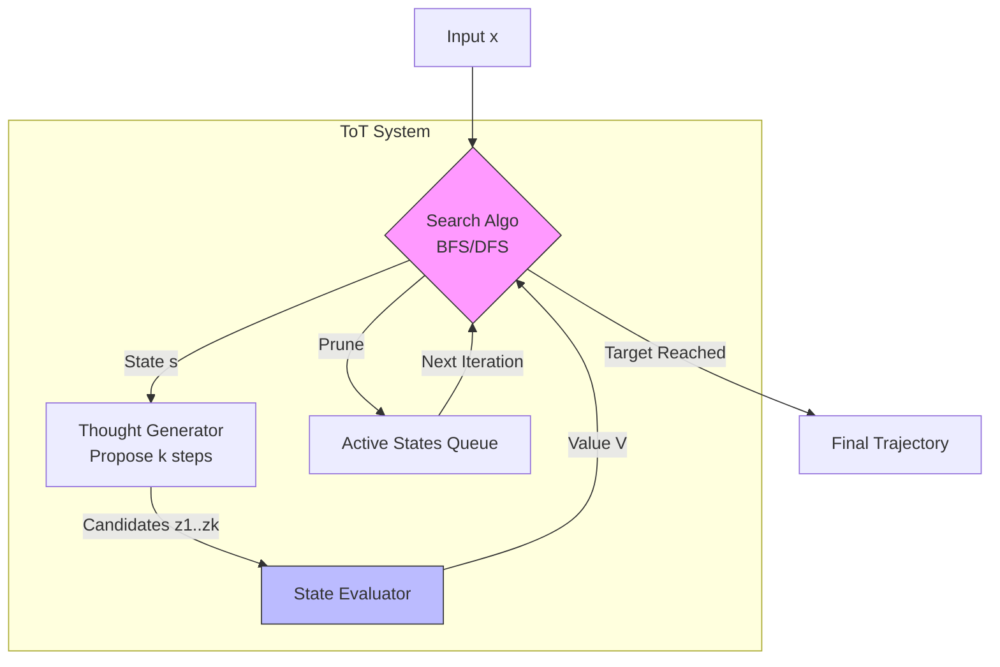

# 第04课：思维树 (ToT) 搜索算法

**关键词**：Search, BFS/DFS, Heuristic Function, 状态空间遍历

---

## 笔记区域

你好。这是《AI Agent 深度架构与数学原理》的第四课。

在前几课中，我们讨论了 Prompt Engineering（隐式贝叶斯推理）和 Chain of Thought（线性推理路径）。
**背景驱动**：
CoT 的核心缺陷在于它是**贪婪的（Greedy）**和**线性的（Linear）**。

1. **局部最优陷阱**：CoT 在每一步 $t$ 倾向于选择局部概率最高的路径，一旦某一步推理出现偏差（Hallucination 或 逻辑跳跃），模型缺乏**回溯（Backtracking）**机制来纠正错误，导致错误级联（Error Cascading）。
2. **缺乏全局规划**：对于像数学证明、代码生成或复杂逻辑谜题（如 24点游戏）这类任务，往往需要**前瞻（Lookahead）**和**全局评估**，单纯的自回归生成无法胜任。

**突破点**：
将 LLM 从单纯的“生成器”降级为“状态转移器”和“启发式评估器”，引入经典人工智能中的**树搜索算法（Tree Search Algorithms）**。这就是 **Tree of Thoughts (ToT)**。

---

# 🧠 第04课：思维树 (ToT) 搜索算法

### 1. 理论核心：在语义空间中的启发式搜索

#### 1.1 问题形式化：状态空间搜索

我们将复杂的推理任务建模为在**思维空间（Thought Space）**中的搜索问题。定义为一个四元组 $\mathcal{T} = \langle S, A, P, V \rangle$：

1. **状态空间 (State Space, $S$)**：
   当前的部分解。$s = [x, z_{1 \dots i}]$，其中 $x$ 是输入，$z$ 是思维步骤。
2. **动作空间 (Action Space, $A$)**：
   这一步与传统 RL 不同。动作不是输出一个 Token，而是生成**一个思维步骤（A Thought Step）**。
   $z_{i+1} \in A(s_i)$。例如在写代码时，一个 Action 可能是一段完整的函数定义。
3. **转移模型 (Transition Model, $P_\theta$)**：
   由 LLM 提供。$P_\theta(s' | s, a)$。即基于当前状态生成下一个思维步骤。
   $$
   z_{i+1} \sim \text{LLM}(z_{i+1} | x, z_{1 \dots i})
   $$
4. **价值函数 (Value Function, $V$)**：
   这是 ToT 的灵魂。我们需要一个启发式函数来评估状态 $s$ 距离解决问题还有多远。
   $$
   V(s) \in [0, 1] \quad \text{or} \quad V(s) \in \mathbb{R}
   $$

#### 1.2 核心假设

ToT 建立在两个核心假设之上：

1. **分解假设**：复杂问题可以分解为中间步骤（Thoughts）。
2. **评估假设**：LLM 识别“好状态”的能力强于其直接生成“好结果”的能力。（类似于 P vs NP 问题：验证解比求解容易）。

#### 1.3 算法流程 (BFS 变体)

以广度优先搜索（BFS）为例，ToT 的数学过程如下：

对于每一步 $t = 1 \dots T$:

1. **Generate (Expansion)**: 对当前候选集 $S_t$ 中的每个状态 $s$，利用 LLM 生成 $k$ 个候选思维 $z^{(1 \dots k)}$。
2. **Evaluate (Heuristic)**: 利用 LLM 对每个新状态 $s \cup \{z^{(j)}\}$ 进行评分或投票。
3. **Select (Pruning)**: 根据评分保留 Top-$b$ 个状态进入 $S_{t+1}$。

---

### 2. 架构解剖与工程应用

#### 2.1 工程流水线 (Pipeline)

在实际工程中，ToT 包含四个核心模块：

1. **Decomposer (分解器)**：将 Prompt 解析为特定的步骤格式。
2. **Generator (生成器)**：
   * *Sample (i.i.d)*: 独立采样 $k$ 次（适用于创作型任务，增加多样性）。
   * *Propose (Sequential)*: 用 Few-shot Prompt 让 LLM 一次性列举 $k$ 个选项（适用于逻辑型任务）。
3. **Evaluator (评估器)**：
   * *Value*: 给定状态，输出标量评分（如 1-10，或 Sure/Likely/Impossible）。
   * *Vote*: 给定多个状态，让 LLM 投票选出最好的。
4. **Controller (控制器)**：实现 BFS、DFS 或 MCTS 逻辑的 Python 代码。

#### 2.2 系统设计图 (Mermaid)



---

### 3. 代码实战 (Implementation Lab)

我们将实现一个基于 **BFS (Beam Search)** 的通用 ToT 框架。为了硬核展示原理，我们手动实现状态管理和搜索逻辑。

**场景**：24点游戏（使用 4 个数字通过加减乘除得到 24）。

```python
import itertools
from typing import List, Tuple, Dict
import heapq

class ToTNode:
    def __init__(self, state: str, value: float, history: List[str]):
        self.state = state   # 当前剩下的数字，如 "10 14"
        self.value = value   # 评估分数
        self.history = history # 推理轨迹，如 ["4+9=13", "13+1=14"]

    def __lt__(self, other):
        # 用于优先队列（虽然BFS用list排序更多，但为了接口通用性）
        return self.value < other.value

class TreeOfThoughts:
    def __init__(self, llm_model, beam_width=5, max_depth=4):
        self.llm = llm_model
        self.b = beam_width
        self.max_steps = max_depth

    def generate_thoughts(self, node: ToTNode, k=3) -> List[str]:
        """
        [Generator]: 给定当前状态，生成 k 个可能的下一步运算。
        Prompt Engineering: "Current numbers: 4 9 10 13. Generate 3 possible next steps."
        """
        prompt = f"Current numbers: {node.state}. History: {node.history}. Propose {k} next valid operations."
        # mock_llm_call(prompt) -> returns ["4+9=13 (left: 13, 10, 13)", "10-4=6 (left: 6, 9, 13)"]
        return self.llm.propose(prompt, n=k)

    def evaluate_states(self, candidates: List[Tuple[str, List[str]]]) -> List[float]:
        """
        [Evaluator]: 评估状态是否有希望到达 24。
        Prompt Engineering: "Numbers: 13 10 13. Goal: 24. Is it possible? Score 0.0 to 1.0"
        """
        prompts = [f"Numbers: {state}. Can we reach 24? Rate 0.0-1.0" for state, _ in candidates]
        # mock_llm_value(prompts) -> returns [0.9, 0.1, ...]
        return self.llm.value(prompts)

    def solve(self, initial_numbers: str):
        # 初始化
        current_layer = [ToTNode(state=initial_numbers, value=1.0, history=[])]
      
        for step in range(self.max_steps):
            print(f"--- Depth {step} | Candidates: {len(current_layer)} ---")
          
            # 1. Expand (Generate)
            next_candidates = [] # List of (new_state, new_history)
            for node in current_layer:
                # 检查是否已解决
                if self.check_success(node.state):
                    return node.history
              
                thoughts = self.generate_thoughts(node)
                for thought in thoughts:
                    # 解析 thought 得到 new_state (这一步通常需要简单的规则解析)
                    new_state = self.parse_state(thought) 
                    new_history = node.history + [thought]
                    next_candidates.append((new_state, new_history))

            if not next_candidates:
                break

            # 2. Evaluate
            # 这里的关键是：我们是在评估“未来”，而不是评估“过去”
            scores = self.evaluate_states(next_candidates)

            # 3. Prune (Select Top-b)
            # 构建新节点
            new_nodes = []
            for i, (new_state, new_hist) in enumerate(next_candidates):
                new_nodes.append(ToTNode(new_state, scores[i], new_hist))
          
            # 排序并截断
            new_nodes.sort(key=lambda x: x.value, reverse=True)
            current_layer = new_nodes[:self.b]
          
            # Debug log
            print(f"Best state: {current_layer[0].state} (Score: {current_layer[0].value})")

        return None

    def check_success(self, state):
        return "24" in state and len(state.split()) == 1
  
    def parse_state(self, thought):
        # Mock parsing: "4+9=13 (left: 13 10 13)" -> "13 10 13"
        return thought.split("left:")[1].strip(")")

# 注意：这是一个算法骨架。在真实工程中，Evaluator 极其难调，需要 Few-shot CoT 来引导评分。
```

---

### 4. Paper Driven：核心论文与贡献

1. **Yao et al. (NeurIPS 2023)**: *Tree of Thoughts: Deliberate Problem Solving with Large Language Models*.
   * **贡献**：正式提出 ToT 框架。对比了 IO, CoT, CoT-SC, ToT 四种模式。
   * **数据**：在 Game of 24 中，CoT 成功率仅 4%，ToT 提升至 74%。证明了在需要规划的任务中，搜索优于生成。
2. **Long (2023)**: *Large Language Model Guided Tree-of-Thought*.
   * **贡献**：引入了 **RL 强化学习** 的概念，利用 Policy Gradient 来微调 ToT 的 Controller。
3. **Zhou et al. (2023)**: *Language Agent Tree Search (LATS)*.
   * **核心升级**：将简单的 BFS/DFS 升级为 **MCTS (蒙特卡洛树搜索)**。
   * **原理**：引入反向传播（Backpropagation）。当叶子节点被判定为失败/成功时，价值会向上传播更新父节点的 Value。这解决了 BFS 贪婪、缺乏长远视野的问题。

---

### 5. Critical Thinking：批判性分析

ToT 虽然强大，但不是银弹。

1. **性能瓶颈 (Latency & Cost)**:
   * **分析**：ToT 的计算复杂度是 $O(b^d)$。如果 $b=5, d=5$，理论上可能产生数千次 LLM 调用。这在即时响应系统中是不可接受的。
   * **解决思路**：**剪枝优化**。如果 $V(s) < \epsilon$，直接丢弃，不进行扩展。或者使用 **Speculative Decoding**，用小模型生成树，大模型评估树。
2. **评估幻觉 (Evaluation Hallucination)**:
   * **局限**：ToT 极其依赖 Evaluator 的准确性。如果 LLM 自身无法判断“这一步走得好不好”（比如复杂的数学证明），ToT 就会退化为随机搜索。
   * **解决思路**：**External Verifier**。不要让 LLM 给代码打分，用 Unit Test 给代码打分；不要让 LLM 算数，用 Python Calculator 算数。将 ToT 与 Tool Use 结合。
3. **Context Window 爆炸**:
   * **局限**：树的深层节点需要携带从 Root 开始的完整历史。
   * **解决思路**：**State Abstraction**。只传递当前状态（如 24点中剩下的数字），丢弃历史推理过程，除非需要回溯。

---

### 6. 前沿扩展

* **Graph of Thoughts (GoT)**:
  ToT 只是树，节点间没有横向联系。GoT 允许**思维聚合 (Aggregation)**。例如，生成三个不同的摘要（分支），然后用一个新节点将这三个摘要合并为一个更好的摘要。这构建了一个 DAG（有向无环图）。
* **Algorithm of Thoughts (AoT)**:
  为了解决 ToT 的计算成本，AoT 试图通过 Prompt Engineering 强迫 LLM 在**一次 Context 生成**中模拟 DFS 的搜索过程（自回归地生成搜索轨迹），试图兼得 CoT 的速度和 ToT 的广度。
* **AlphaZero-like Agent**:
  最前沿的研究正在尝试用训练好的 **Value Network** (类似于 AlphaGo 的 Value Head) 来替代 Prompt-based Evaluator，彻底解决评估不准的问题。

---

### 总结

ToT 的本质是将 **System 1 的直觉（生成）** 与 **System 2 的逻辑（搜索）** 解耦。
工程上，ToT 是一种**用推理时间（Inference Compute）换取智能（Intelligence）**的架构模式。

下一课，我们将深入 **记忆系统 (Memory Systems)**，探讨如何利用 RAG 和向量数据库为这些搜索算法提供无限的知识支持。
