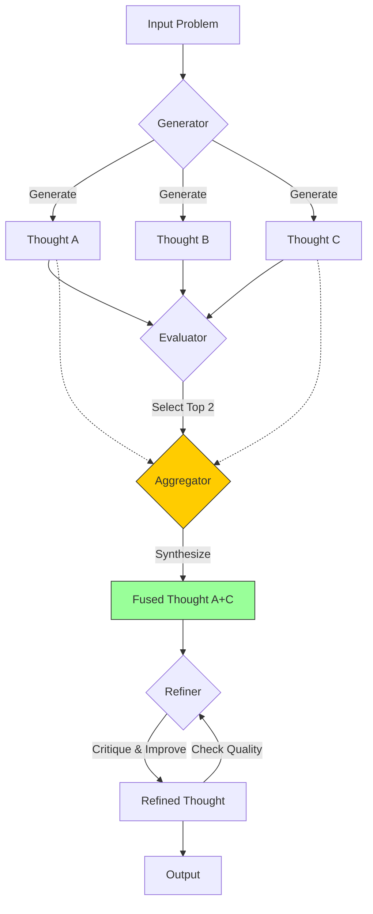

# 第05课：思维图 (GoT) 与非线性推理

**关键词**：Graph Theory, DAG (有向无环图), Aggregation, Refinement

---

## 笔记区域

你好。这是《AI Agent 深度架构与数学原理》的第五课。

在前几课中，我们从线性的 CoT 进化到了树状的 ToT。
ToT 虽然引入了搜索（Search）和回溯（Backtracking），但它仍然受限于**层级结构（Hierarchical Structure）**。
**背景挑战**：
现实世界中的复杂推理往往不是“树状”的，而是“网状”的。人类思考时会进行**协同（Synergy）**与**融合（Synthesis）**。
例如，写一篇综述论文，你不会只沿着一条思路写到底（CoT），也不会写三个版本然后只选一个最好的（ToT），而是会写三个草稿，然后提取各自的优点，**合并**成一个完美的版本。
**突破点**：
将推理建模为**有向图（Directed Graph）**，允许思维路径进行**分叉（Branching）**、**汇聚（Aggregation）**和**循环（Looping）**。这就是 **Graph of Thoughts (GoT)**。

---

# 🧠 第05课：思维图 (GoT) 与非线性推理

### 1. 理论核心：推理拓扑学 (Reasoning Topology)

#### 1.1 数学定义：推理图

我们将推理过程形式化为一个元组 $\mathcal{G} = \langle V, E, \mathcal{T} \rangle$：

1. **节点 (Vertex, $v$)**：
   代表一个思维状态（Thought State）。与 ToT 相同，$v = [x, z_{1 \dots i}]$。
2. **边 (Edge, $e$)**：
   代表依赖关系。$(u, v) \in E$ 表示思维 $v$ 是基于思维 $u$ 构建的。
3. **变换算子 (Transformations, $\mathcal{T}$)**：
   这是 GoT 相对于 ToT 的核心数学增量。ToT 只有“生成”和“选择”。GoT 引入了**高阶思维算子**：

   * **生成变换 ($\mathcal{T}_{gen}$)**: $1 \to N$。类似于 CoT/ToT 的 Expansion。
     $$
     \{v_{new}^{(1)}, \dots\} = \mathcal{T}_{gen}(v_{old})
     $$
   * **聚合变换 ($\mathcal{T}_{agg}$)**: $N \to 1$。这是 GoT 的灵魂。将多个父节点的思维特征融合为一个新节点。
     $$
     v_{fused} = \mathcal{T}_{agg}(v_1, v_2, \dots, v_k)
     $$

     数学上，这近似于在语义空间中寻找多个向量的加权中心或逻辑交集。
   * **细化变换 ($\mathcal{T}_{ref}$)**: $1 \to 1$。自我修正循环（Self-Correction Loop）。
     $$
     v_{refined} = \mathcal{T}_{ref}(v_{old})
     $$

#### 1.2 优化目标

GoT 的目标是寻找一个图结构 $G$ 和执行路径，使得最终节点 $v_{final}$ 的价值最大化：

$$
G^* = \arg\max_{G} \text{Score}(v_{final} | G, x)
$$

这不仅是寻找最优路径，甚至是**动态构建最优计算图**的过程。

---

### 2. 架构解剖与工程应用

#### 2.1 常见的 GoT 拓扑结构

在工程实践中，我们不需要每次都生成随机图，而是使用几种固定的设计模式（Design Patterns）：

1. **Aggregation (聚合模式)**: 3个草稿 -> 1个终稿。
2. **Refinement (精炼模式)**: 草稿 -> 修改意见 -> 修改稿 (循环)。
3. **Cascade (级联模式)**: 分治法。将问题拆解，分别解决，再合并。

#### 2.2 系统设计图 (Mermaid)



#### 2.3 工程步骤：以“排序算法”为例

Besta et al. (2024) 在论文中通过让 LLM 对数字序列进行排序来演示 GoT。虽然 LLM 不适合做排序，但这个例子完美展示了逻辑。

1. **Input**: 一个乱序数组 `[4, 1, 3, 2]`。
2. **Generate**: 将数组拆分为子数组（Sub-arrays）。
   * $v_1$: `[4, 1]`
   * $v_2$: `[3, 2]`
3. **Execute**: 分别对子数组排序（LLM 操作）。
   * $v'_1$: `[1, 4]`
   * $v'_2$: `[2, 3]`
4. **Aggregate (Merge)**: 将两个有序子数组合并。
   * **Prompt**: "Merge these two sorted arrays into one sorted array: `[1, 4]` and `[2, 3]`."
   * $v_{final}$: `[1, 2, 3, 4]`
5. **Result**: 这是一个典型的 **Merge Sort** 逻辑的 GoT 实现。

---

### 3. Code & Engineering：实现聚合算子 (Aggregation)

我们将实现一个基于 LangChain 思想的原生 Python GoT 控制器，重点展示 **Aggregation** 的逻辑。

**场景**：多文档综述撰写（Multi-document Synthesis）。

```python
from typing import List
import openai

class GraphNode:
    def __init__(self, id: str, content: str, parents: List['GraphNode'] = None):
        self.id = id
        self.content = content
        self.parents = parents if parents else []
        self.score = 0.0

class GraphOfThoughts:
    def __init__(self, llm_client, model="gpt-4"):
        self.client = llm_client
        self.model = model
        self.nodes = {} # id -> Node

    def generate_thoughts(self, parent: GraphNode, k=3) -> List[GraphNode]:
        """ T_gen: 1 -> N (发散) """
        prompt = f"Based on: {parent.content}\nGenerate {k} different perspectives/drafts."
        # ... (LLM call to get k responses) ...
        # Mock responses
        return [GraphNode(f"{parent.id}_child_{i}", f"Draft {i}...", [parent]) for i in range(k)]

    def aggregate_thoughts(self, nodes: List[GraphNode]) -> GraphNode:
        """ 
        T_agg: N -> 1 (聚合) 
        这是 GoT 的核心：Synthesis
        """
        # 1. 构造 Context，包含所有父节点的内容
        combined_context = "\n---\n".join([f"Thought {i+1}: {n.content}" for i, n in enumerate(nodes)])
      
        # 2. Aggregation Prompt
        prompt = f"""
        You are a research lead. I have 3 different drafts explaining a concept.
        Your task is to SYNTHESIZE them into a single, superior version.
        Combine the detailed examples from Thought 1, the logical structure from Thought 2, and the concise style of Thought 3.
      
        Input Drafts:
        {combined_context}
      
        Synthesized Output:
        """
      
        # 3. LLM Call
        response = self._call_llm(prompt)
      
        # 4. Create new Node linked to all parents
        new_node_id = "agg_" + "_".join([n.id.split("_")[-1] for n in nodes])
        return GraphNode(new_node_id, response, parents=nodes)

    def _call_llm(self, prompt):
        # Mock API call
        return "This is the synthesized superior version combining all inputs."

    def execute_pipeline(self, initial_problem: str):
        # 1. Root
        root = GraphNode("root", initial_problem)
      
        # 2. Branching (Generate 3 drafts)
        drafts = self.generate_thoughts(root, k=3)
        print(f"Generated {len(drafts)} drafts.")
      
        # 3. Evaluation (Mock scoring)
        # 实际工程中需要 LLM 评分
        drafts[0].score = 0.8
        drafts[1].score = 0.9  # Best structure
        drafts[2].score = 0.7
      
        # 4. Selection & Aggregation
        # 假设我们选择 Top-2 进行合并，而不是只选 Top-1 (ToT的做法)
        top_nodes = sorted(drafts, key=lambda x: x.score, reverse=True)[:2]
        print(f"Aggregating top nodes: {[n.id for n in top_nodes]}")
      
        final_result = self.aggregate_thoughts(top_nodes)
      
        return final_result.content

# --- Run ---
# got = GraphOfThoughts(openai.Client())
# result = got.execute_pipeline("Explain Quantum Entanglement")
# print(result)
```

**代码解析**：

* `parents` 列表：这是图结构的物理实现。聚合节点同时拥有多个父节点。
* `aggregate_thoughts`：这是与 ToT 的本质区别。ToT 只会 `select` 一个最好的，丢弃其他的；GoT 利用 Prompt 融合多个节点的优点。

---

### 4. Paper Driven：核心论文与贡献

1. **Besta et al. (ICLR 2024)**: *Graph of Thoughts: Solving Elaborate Problems with Large Language Models*.
   * **核心贡献**：提出了 GoT 框架，形式化了 `Aggregate` 操作。
   * **实验结果**：在排序任务（Sorting）和集合操作（Set Intersection）等需要全局信息的任务上，GoT 优于 ToT。因为 ToT 丢弃的分支可能包含全局最优解所需的局部信息。
2. **Yao et al. (2023)**: *Cumulative Reasoning with Large Language Models*.
   * **相关性**：虽然名字不叫 GoT，但提出了 "Proposition" 的概念，Agent 保存所有历史命题，并在每一步推理中从历史命题池中组合新的命题。这本质上是一个全连接的思维图。

---

### 5. Critical Thinking：批判性分析

GoT 看似完美，但落地极难。

1. **Context Window 爆炸 (The Context Bottleneck)**:

   * **分析**：在执行 `Aggregate(v1, v2, v3)` 时，你需要把 $v_1, v_2, v_3$ 的完整内容都放入 Prompt。
   * **瓶颈**：如果 $v$ 是长文档，聚合操作会迅速耗尽 Context Window（或导致 Token 费用指数级上升）。
   * **解决**：在聚合前进行 **Summarization**，或者使用 **kv-cache sharing** 技术（如果节点共享相同的前缀）。
2. **拓扑结构设计难题 (Topology Engineering)**:

   * **分析**：ToT 的树结构是通用的，但 GoT 的图结构往往是任务特定的（Task-specific）。写代码可能需要 Loop 结构，写文章可能需要 Aggregation 结构。
   * **解决**：**Self-Map Generation**。让 LLM 自己先规划计算图（Plan the Graph），然后再执行图。这是 LangGraph 的设计理念。
3. **延迟 (Latency)**:

   * **分析**：GoT 的并行度虽然高（生成 drafts 时），但 Aggregation 是同步阻断点（Sync Barrier）。必须等所有父节点生成完才能聚合。
   * **代价**：比单次调用慢 $K$ 倍。

---

### 6. 前沿扩展

* **GoT + RAG = GraphRAG**:
  这节课讲的是“思维图”。如果我们将图中的节点替换为“知识点”，边替换为“关联关系”，这就是微软最近提出的 **GraphRAG**。

  * *Mechanism*: GoT 是在推理时动态建图；GraphRAG 是在索引时预先建图。
  * *Combined*: Agent 在 GraphRAG 的知识图谱上游走（Walk），每一步游走产生一个 GoT 的思维节点。
* **LangGraph**:
  LangChain 推出的 **LangGraph** 库是 GoT 工程落地的最佳工具。它引入了 **Cyclic Graph**（有环图）的概念，允许定义 `Nodes` (Agent actions) 和 `Edges` (Conditions)，天然支持 GoT 中的 Refinement Loop。

---

### 总结

GoT 标志着 Prompt Engineering 彻底转变为 **Workflow Engineering**。
我们不再试图用一句魔法 Prompt 解决问题，而是设计一条**思维流水线（Assembly Line of Thoughts）**，利用聚合和循环来逼近复杂问题的最优解。

**作业**: 思考一下，如果让你设计一个“代码审查 Agent”，你会使用什么样的图结构？（提示：Refinement Loop 是必须的，但哪里可以用 Aggregation？）
