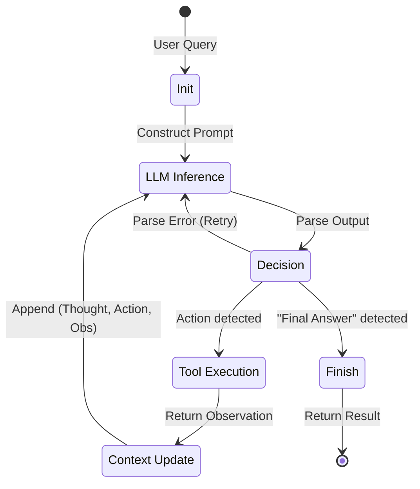

# 第06课：ReAct 范式与状态机

**关键词**：ReAct, FSM (有限状态机), Error Propagation, Thought-Action-Observation

---

## 笔记区域


你好。这是《AI Agent 深度架构与数学原理》的第六课。

在前几课中，我们探讨了 System 2 的推理核心（ToT/GoT/CoT）。但这些大多是**静态的思维游戏**，局限于 LLM 的内部参数。
今天，我们将跨越“大脑”与“世界”的边界，探讨 **ReAct (Reasoning + Acting)** 范式。
更重要的是，我们将从**计算机科学（CS）**的角度，把 ReAct 解构为一个**有限状态机（Finite State Machine, FSM）**。这是目前 Agent 工程界（如 LangGraph, AutoGen）从“脚本”走向“系统”的理论基石。

---

# 🧠 第06课：ReAct 范式与状态机 (The ReAct Paradigm & State Machines)

### 0. 背景驱动：从“空想”到“实干”

* **挑战 (Challenge)**：
  1. **事实幻觉 (Hallucination)**：单纯的 CoT (Reasoning only) 容易一本正经地胡说八道，因为缺乏外部事实锚定。
  2. **误差累积 (Error Propagation)**：单纯的 Action (如 WebGPT 的操作流) 如果没有 Reasoning 指导，容易在复杂的交互环境中迷失目标，变成无头苍蝇。
* **突破点 (Breakthrough)**：
  **Yao et al. (ICLR 2023)** 提出的 ReAct 范式。
  它不仅是 Prompt 技巧，更是一种**控制流模式**：将推理（Thought）作为行动（Action）的先验，将观察（Observation）作为下一轮推理的后验。
* **改进方向**：
  从 **Open-loop System (开环)** 转向 **Closed-loop Control System (闭环控制)**。

---

### 1. 理论核心：POMDP 与 状态机形式化

#### 1.1 数学定义：ReAct 的 POMDP 视角

我们将 Agent 视为在 **POMDP (部分可观测马尔可夫决策过程)** 中运行的策略。
元组定义：$\mathcal{M} = \langle \mathcal{S}, \mathcal{A}, \mathcal{O}, \mathcal{T}, \mathcal{R} \rangle$

* **动作空间 $\mathcal{A} = \mathcal{A}_{lang} \cup \mathcal{A}_{tool}$**：
  * $\mathcal{A}_{lang}$ (Reasoning): 生成自然语言思维（Thought）。
  * $\mathcal{A}_{tool}$ (Acting): 生成工具调用指令（Action）。
* **轨迹 (Trajectory) $\tau_t$**：
  $$
  \tau_t = (o_1, a_{lang}^1, a_{tool}^1, o_2, a_{lang}^2, a_{tool}^2, \dots, o_t)
  $$

  这里 $o_t$ 是环境反馈（Observation）。
* **策略 (Policy) $\pi_\theta$**：
  $$
  a_t \sim \pi_\theta(a | \tau_{t-1}, o_t)
  $$

  LLM 的本质就是拟合这个条件概率分布。

#### 1.2 ReAct as a State Machine (FSM)

在工程实现上，ReAct 不是一条直线，而是一个**循环状态机**。
定义 FSM $\mathcal{M}_{FSM} = (Q, \Sigma, \delta, q_0, F)$：

* **状态集 $Q$**: $\{ \text{THOUGHT}, \text{ACTION}, \text{OBSERVATION}, \text{FINAL\_ANSWER} \}$
* **转移函数 $\delta$**:
  * $\text{THOUGHT} \xrightarrow{\text{decide tool}} \text{ACTION}$
  * $\text{ACTION} \xrightarrow{\text{execute}} \text{OBSERVATION}$
  * $\text{OBSERVATION} \xrightarrow{\text{update context}} \text{THOUGHT}$
  * $\text{THOUGHT} \xrightarrow{\text{finish}} \text{FINAL\_ANSWER}$

这种形式化对于理解 **LangGraph** 等现代框架至关重要：Agent 本质上是在图（Graph）上游走的节点，边（Edge）就是 LLM 的决策。

---

### 2. 架构解剖与工程应用

#### 2.1 工程交互流程 (I/O Flow)

在实际应用中（例如构建一个 SQL Agent），ReAct 的步骤如下：

1. **Input (Prompt Construction)**:
   * User Query: "最近一个月销售额最高的产品是啥？"
   * Prompt Head: 定义工具（Tools Schema）和 Few-shot ReAct 示例。
   * Context: 历史轨迹。
2. **LLM Output (Reasoning & Acting)**:
   * Raw String: `Thought: 我需要查询 sales 表，按时间过滤... Action: sql_query("SELECT item FROM sales ...")`
3. **Parser (Control Logic)**:
   * 正则提取 `sql_query` 及其参数。
   * **关键点**：如果解析失败，系统应自动生成一个 "System Message: Format Error" 并喂回给 LLM（自修正）。
4. **Environment (Execution)**:
   * 执行 SQL，捕获结果（或报错信息）。
   * Truncation: 如果结果太长（如查出 1000 行），必须进行截断或摘要，防止爆 Context Window。
5. **Loop (Next State)**:
   * 将 `Observation: [Result]` 拼接到 Context，进入下一轮 LLM 调用。

#### 2.2 系统架构图 (Mermaid)



---

### 3. Code & Engineering：手搓一个 ReAct 状态机

我们不使用 LangChain 的 `AgentExecutor`（黑盒），而是用原生 Python 实现一个基于 FSM 的 ReAct Loop。重点展示**状态管理**和**解析逻辑**。

```python
import re
from typing import List, Dict, Callable

class ReActState:
    """定义 Agent 的内存状态"""
    def __init__(self, query: str):
        self.query = query
        self.history: List[str] = [] # 存储轨迹: Thought -> Action -> Obs
        self.finished = False
        self.final_answer = ""

class ReActAgent:
    def __init__(self, llm_func: Callable, tools: Dict[str, Callable]):
        self.llm = llm_func
        self.tools = tools
        self.max_steps = 10
        # ReAct 的核心 Prompt 模板
        self.prompt_template = """
Answer the following questions as best you can. You have access to the following tools:
{tool_descs}

Use the following format:
Question: the input question you must answer
Thought: you should always think about what to do
Action: the action to take, should be one of [{tool_names}]
Action Input: the input to the action
Observation: the result of the action
... (this Thought/Action/Action Input/Observation can repeat N times)
Thought: I now know the final answer
Final Answer: the final answer to the original input question

Question: {query}
"""

    def step(self, state: ReActState) -> ReActState:
        """ FSM 的单步转移函数 """
        # 1. Construct Context
        scratchpad = "\n".join(state.history)
        prompt = self.prompt_template.format(
            tool_descs=self._get_tool_str(),
            tool_names=", ".join(self.tools.keys()),
            query=state.query
        ) + "\n" + scratchpad
      
        # 2. LLM Inference (Reasoning + Acting)
        print(f"--- Calling LLM ---")
        response = self.llm(prompt, stop=["Observation:"]) # 关键：Stop Token
        print(f"LLM Output: {response}")
      
        # 3. Parse Output
        thought, action, action_input = self._parse_output(response)
      
        # 4. State Transition Logic
        if "Final Answer" in response:
            state.finished = True
            state.final_answer = response.split("Final Answer:")[-1].strip()
            return state
      
        if not action:
            # Parse Error Handling
            state.history.append(f"{response}\nObservation: Error: Could not parse Action. Please ensure you use 'Action:' and 'Action Input:'.")
            return state

        # 5. Tool Execution (Environment Interaction)
        state.history.append(response) # 记录 Thought & Action
        try:
            tool_func = self.tools.get(action)
            if tool_func:
                observation = tool_func(action_input)
            else:
                observation = f"Error: Tool '{action}' not found."
        except Exception as e:
            observation = f"Error: Tool execution failed: {str(e)}"
          
        print(f"Observation: {observation}")
        state.history.append(f"Observation: {observation}")
      
        return state

    def run(self, query: str):
        state = ReActState(query)
        steps = 0
        while not state.finished and steps < self.max_steps:
            state = self.step(state)
            steps += 1
        return state.final_answer

    def _get_tool_str(self):
        return "\n".join([f"{name}: useful func" for name in self.tools.keys()])

    def _parse_output(self, text):
        """ 鲁棒的正则解析 """
        action_match = re.search(r"Action:\s*(.*?)[\n]", text)
        input_match = re.search(r"Action Input:\s*(.*)", text, re.DOTALL)
      
        if action_match and input_match:
            return None, action_match.group(1).strip(), input_match.group(1).strip()
        return None, None, None

# --- Mock Execution ---
# def mock_llm(prompt, stop):
#     if "Observation" not in prompt:
#         return "Thought: I need to search.\nAction: search\nAction Input: weather SF"
#     else:
#         return "Thought: I have the info.\nFinal Answer: It is sunny."
# 
# agent = ReActAgent(mock_llm, {"search": lambda x: "Sunny"})
# print(agent.run("Weather?"))
```

---

### 4. Paper Driven：核心论文与贡献

1. **Yao et al. (ICLR 2023)**: *ReAct: Synergizing Reasoning and Acting in Language Models*.
   * **核心贡献**: 证明了 `Reasoning` 有助于模型处理动态环境（如果不思考，模型可能在搜索出错后不知道改搜索词）；`Acting` 有助于 `Reasoning` 落地（如果不搜索，模型只能胡编）。
   * **关键实验**: 在 HotpotQA (多跳问答) 和 Fever (事实核查) 任务上，ReAct 显著优于 CoT 和 Act-only 方法。
2. **Shinn et al. (NeurIPS 2023)**: *Reflexion: Language Agents with Verbal Reinforcement Learning*.
   * **核心改进**: ReAct 的主要问题是**死循环**。Reflexion 引入了 `Heuristic Evaluator` 检测失败，并触发 LLM 生成 `Self-Reflection`（自我反思），保存到短期记忆中，指导下一次尝试。
   * 这实际上是在 ReAct 的 FSM 上增加了一个 **Back-edge (回边)** 到 Reasoning 状态，并带有 Feedback。

---

### 5. Critical Thinking：批判性分析

ReAct 是目前最通用的范式，但它是完美的吗？

1. **Latency (延迟瓶颈)**:

   * **分析**: ReAct 是串行的（Serial）。步骤 $t$ 必须等待步骤 $t-1$ 的 Observation。对于简单的任务（如“查天气”），ReAct 显得过于繁琐和缓慢。
   * **思路**: **Parallel Function Calling** (OpenAI 最新更新) 允许一次生成多个 Action，将 $O(N)$ 的网络请求降为 $O(1)$。
2. **Context Window (上下文消耗)**:

   * **分析**: 随着 Loop 次数增加，Observation（如网页 HTML、SQL 结果）会迅速填满 Context。
   * **思路**: **Observation Summarization**。不要把原始 HTML 塞进 History，而是让 LLM 先把 HTML 总结为与 Query 相关的信息，再存入 History。
3. **Robustness (鲁棒性)**:

   * **分析**: ReAct 极其依赖 LLM 遵循 `Action: ...` 的格式。一旦模型“聊嗨了”忘记格式，解析器就会报错，导致 Agent 崩溃。
   * **思路**: **Fine-tuning (微调)**。如 **FireAct** 论文所述，使用 ReAct 轨迹微调小模型（Llama-7B），使其内化 ReAct 格式，比用 GPT-4 Prompting 更稳健且便宜。

---

### 6. 前沿扩展

* **ReAct + FSM (LangGraph)**:

  * ReAct 只是 FSM 的一种特例（简单的 Loop）。**LangGraph** 允许开发者显式定义更复杂的图结构。例如：
    * `Planner Node` 生成计划。
    * `Worker Node` 执行计划。
    * `Critique Node` 检查结果。
    * 如果通过 -> End；如果不通过 -> 回到 Planner。
  * 这种 **Cyclic Graph** 结构是构建复杂 Agent（如软件工程师 Agent）的标准。
* **ReAct + Vision (Multimodal)**:

  * **AppAgent (Tencent)**: 将 Observation 从文本变为“手机截屏 + XML DOM”。Action 变为 `Tap(x, y)`。
  * ReAct 的逻辑不变，但 Input/Output 模态发生了变化。

---

### 总结

ReAct 将 Agent 从“单次问答”变成了“连续决策”。**状态机（FSM）** 是理解和实现 ReAct 的最佳工程视角。
掌握了 ReAct，你就掌握了 Agent 的**操作系统内核**。

**作业**: 基于提供的代码，添加一个 `max_retries` 机制。当 LLM 输出无法解析时，不要直接 Crash，而是构建一个包含错误信息的 Prompt 喂回给 LLM，让它重试。（这是 Reflexion 的雏形）。
