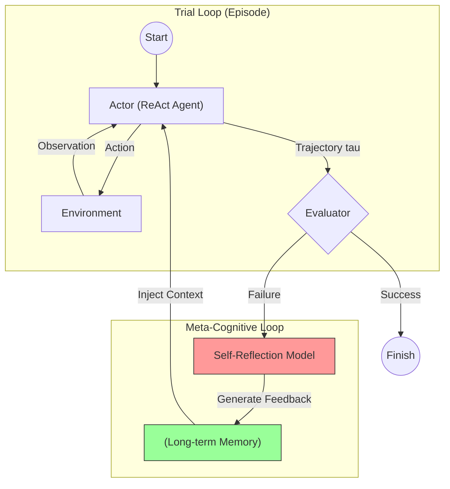

# 第07课：自反思 (Reflexion) 机制

**关键词**：RL, Verbal Reinforcement, Episodic Memory Buffer, Feedback Loop, 双循环架构

---

## 笔记区域

你好。这是《AI Agent 深度架构与数学原理》的第七课。

在上一课中，我们将 ReAct 建模为一个有限状态机（FSM）。然而，标准的 ReAct 存在一个致命缺陷：**它是无状态的（Stateless）或者说是“健忘”的**。当 Agent 在一个复杂的轨迹中失败（例如陷入死循环或得出错误答案）时，如果你简单地重置环境并再次运行，它很大概率会重蹈覆辙。

**背景驱动**：

* **挑战**：人类在解决问题时，会从失败中学习（Trial and Error）。传统的强化学习（RL）通过标量奖励（Scalar Reward）来更新权重，但对于 LLM 来说，PPO/RLHF 的训练成本太高，无法用于**在线（Online）**的任务适应。
* **突破点**：**Verbal Reinforcement Learning（语言强化学习）**。既然 LLM 擅长语言，为什么不直接用“语言”作为反馈信号，而不是无意义的数字（Reward=0/1）？
* **改进方向**：在 ReAct 循环之上增加一个**元认知循环（Meta-cognitive Loop）**，即 **Reflexion**。

---

# 🧠 第07课：自反思 (Reflexion) 机制

### 1. 理论核心：从梯度下降到语境更新

#### 1.1 核心定义：Verbal Reinforcement Learning

Reflexion 本质上是一种**In-Context Reinforcement Learning**。我们不更新模型参数 $\theta$，而是更新**短期记忆（Context）**。

定义 Agent 的策略为 $\pi_\theta(a|s, h)$，其中 $s$ 是当前状态，$h$ 是历史上下文。
传统的 RL 优化目标是最大化期望奖励：

$$
J(\theta) = \mathbb{E}_{\tau \sim \pi_\theta} [R(\tau)]
$$

通过梯度上升更新 $\theta \leftarrow \theta + \alpha \nabla J(\theta)$。

**Reflexion** 保持 $\theta$ 不变，而是优化上下文 $h$。它引入了一个反思算子（Reflection Operator）$M$：

$$
h_{t+1} = h_t \cup \{ \text{reflection}_t \}
$$

$$
\text{reflection}_t = M(\tau_t, \text{Evaluator}(\tau_t))
$$

其中 $\tau_t$ 是第 $t$ 次尝试的失败轨迹。Agent 在第 $t+1$ 次尝试时，其策略变为 $\pi_\theta(a|s, h_{t+1})$。由于 $h_{t+1}$ 包含了对过去错误的“语义描述”，Agent 被迫避开已知的错误路径。

#### 1.2 架构三要素

Reflexion 框架由三个独立的模型（或同一个 LLM 的不同 Prompt 模式）组成：

1. **Actor ($\pi_\theta$)**: 生成轨迹 $\tau$（即 ReAct Agent）。
2. **Evaluator ($E$)**: 评分函数。可以是 LLM 自评，也可以是确定的程序（如 Unit Tests, Compiler）。
   $$
   r = E(\tau) \in \{0, 1\} \quad \text{or} \quad [0, 1]
   $$
3. **Self-Reflection ($M$)**: 生成器。输入失败的轨迹和奖励，输出自然语言形式的“经验教训”。
   $$
   \text{reflection} \sim P_{LLM}(\cdot | \tau, r)
   $$

---

### 2. 架构解剖与工程应用

#### 2.1 系统设计图 (Mermaid)

这是一个**双循环结构**：内层是 ReAct Loop（行动），外层是 Reflexion Loop（进化）。



#### 2.2 工程应用：输入输出流

以**代码生成 Agent**（如 HumanEval）为例：

1. **Episode 0 (Fail)**:

   * **Input**: "写一个 Python 函数计算斐波那契数列。"
   * **Actor Output**: 生成了递归版本，但没有处理 $n<0$ 的情况。
   * **Evaluator**: 运行 Unit Test，发现 `test_fib(-1)` 报错 `RecursionError`。
   * **Context Update**: 此时不仅存储 Error，还触发 Reflection。
2. **Reflection Step**:

   * **Input**: 用户的题 + 错误的代码 + `RecursionError` 堆栈信息。
   * **Reflection Prompt**: "You wrote code that failed. The error is RecursionError on input -1. Briefly summarize why it failed and how to fix it."
   * **Output (Reflection)**: *"I failed to handle negative input cases, causing infinite recursion. I should add a base case check for n < 0."*
3. **Episode 1 (Retry)**:

   * **Input (Augmented)**:
     > System: You are a coding assistant.
     > **Memory: Previous Plan: I failed to handle negative input cases...**
     > User: "写一个 Python 函数计算斐波那契数列。"
     >
   * **Actor Output**: 生成了带有边界检查的正确代码。

---

### 3. Code & Engineering：实现 Reflexion Manager

我们将实现一个通用的 Reflexion 管理器。重点在于**短期记忆的滑动窗口管理**和**反思的注入机制**。

```python
from typing import List, Callable, Optional
from dataclasses import dataclass

@dataclass
class TrialLog:
    trajectory: str  # 包含 Thought/Action/Obs 的完整记录
    is_success: bool
    reflection: Optional[str] = None

class ReflexionAgent:
    def __init__(self, actor_func: Callable, evaluator_func: Callable, reflector_func: Callable):
        self.actor = actor_func       # ReAct Agent
        self.evaluator = evaluator_func # Returns (bool, str_reason)
        self.reflector = reflector_func # LLM generating reflection
        self.memory: List[str] = []   # 存储历史 Reflections
        self.max_retries = 3

    def run(self, task: str):
        # 清空短期记忆（针对新任务）
        self.memory = []
      
        for trial in range(self.max_retries):
            print(f"\n=== Trial {trial + 1} ===")
          
            # 1. Construct Prompt with Reflections
            # 关键工程点：将历史教训放在 Prompt 头部或 System Message 中
            context = self._build_context()
            augmented_task = f"{context}\nTask: {task}"
          
            # 2. Actor Execution (ReAct Loop)
            trajectory = self.actor(augmented_task)
          
            # 3. Evaluation
            success, feedback = self.evaluator(trajectory)
            if success:
                print("✅ Task Success!")
                return trajectory
          
            print(f"❌ Failed: {feedback}")
          
            # 4. Self-Reflection
            # 关键工程点：让 LLM 自己分析由于什么原因导致了失败
            reflection_prompt = f"""
            Task: {task}
            Trajectory: {trajectory}
            Feedback: {feedback}
          
            Analyze the trajectory and feedback. 
            Why did the agent fail? 
            What should it do differently next time?
            Answer concisely in one sentence.
            """
            reflection = self.reflector(reflection_prompt)
            print(f"🧠 Reflection: {reflection}")
          
            # 5. Update Memory
            self.memory.append(reflection)
          
        return "Failed after max retries."

    def _build_context(self) -> str:
        if not self.memory:
            return ""
        # 这里的 Header 是 Reflexion 的标志性设计
        header = "Previous trials failed. Here are the reflections to guide your next attempt:\n"
        items = [f"- {r}" for r in self.memory]
        return header + "\n".join(items)

# --- Mock Implementation ---

def mock_actor_llm(prompt):
    # 模拟：如果 Prompt 里没有 "handle negative"，就返回错误代码
    if "negative" not in prompt.lower():
        return "Code: def fib(n): return fib(n-1) + fib(n-2)"
    else:
        return "Code: def fib(n): if n<0: return 0; return fib(n-1)..."

def mock_evaluator(trajectory):
    if "if n<0" in trajectory:
        return True, "Tests passed."
    return False, "RecursionError on input -1."

def mock_reflector_llm(prompt):
    return "I forgot to handle negative inputs which caused infinite recursion."

# agent = ReflexionAgent(mock_actor_llm, mock_evaluator, mock_reflector_llm)
# agent.run("Write fibonacci")
```

---

### 4. Paper Driven：核心论文与贡献

1. **Shinn et al. (NeurIPS 2023)**: *Reflexion: Language Agents with Verbal Reinforcement Learning*.
   * **核心贡献**：提出了 Reflexion 架构。证明了在 HumanEval（代码生成）任务上，GPT-4 的准确率从 80% 提升到了 91%。
   * **关键洞察**：**Heuristic Scalar Reward（标量奖励）不足以指导 LLM**。LLM 需要语义层面的 "Gradient"，即语言反馈。
2. **Madaan et al. (NeurIPS 2023)**: *Self-Refine: Iterative Refinement with Self-Feedback*.
   * **对比**：Self-Refine 更多用于单次生成的优化（如文本润色），Reflexion 用于多步推理 Agent 的优化。两者核心思想一致：Generate -> Critique -> Refine。
3. **Wang et al. (ICLR 2024)**: *Voyager: An Open-Ended Embodied Agent with Large Language Models*.
   * **应用**：在 Minecraft 游戏中，Voyager 使用类似的机制。当 Agent 执行动作失败（如掉进岩浆），它会生成反思并存入技能库（Skill Library），下次遇到类似情况会检索该反思。

---

### 5. Critical Thinking：批判性分析

Reflexion 非常强大，但也面临严重的**稳定性问题**：

1. **Reflection Hallucination (反思幻觉)**:

   * **现象**：Agent 可能会**错误归因**。例如，代码运行错误是因为库版本不对，但 Agent 反思说是“逻辑错误”并改写了正确的逻辑，导致越改越错。
   * **解决**：Reflector 需要极强的推理能力（通常用 GPT-4），或者引入**Ground Truth 反馈**（如编译器报错信息），而不是仅依赖 LLM 自省。
2. **Context Explosion (上下文爆炸)**:

   * **现象**：随着重试次数增加，Reflexion List 会变得很长，挤占 Context Window，甚至干扰正常的推理（因为充满了负面样本）。
   * **解决**：**Sliding Window (滑动窗口)**。只保留最近 3 次最有价值的反思，或者对反思进行摘要（Summarization）。
3. **Local Minima (局部最优)**:

   * **现象**：Agent 可能陷入一种“反思循环”，即反复提出无效的修改建议。
   * **解决**：设置**多样性参数 (Temperature)**，或者在多次反思无效后强制重置思路（Reset Thought）。

---

### 6. 前沿扩展

* **Reflexion + RAG**:
  * 在 RAG 系统中，如果检索结果 $D$ 无法回答问题 $x$，Agent 可以反思：“我检索的关键词可能太宽泛了”。下一轮尝试时，生成更精确的 Query。这被称为 **Self-RAG** 或 **Corrective RAG (CRAG)**。
* **Reflexion + Visual Agent**:
  * 在机器人控制或 GUI Agent 中，如果点击按钮没反应，视觉模型可以反思：“我可能点击偏了”或“页面还没加载完”，从而调整下一次动作的坐标或增加等待时间。

---

### 总结

Reflexion 赋予了 Agent **“从错误中学习”** 的能力，而不需要昂贵的模型微调。
这是 Agent 从 **“无状态的执行者”** 进化为 **“有经验的专家”** 的关键一步。在工程中，设计一个**鲁棒的 Evaluator** 往往比设计 Actor 更重要。

下一课，我们将探讨 Agent 的“外脑”——**蒙特卡洛树搜索 (MCTS) 与 Agent**，看看如何利用概率搜索进一步增强推理能力。
