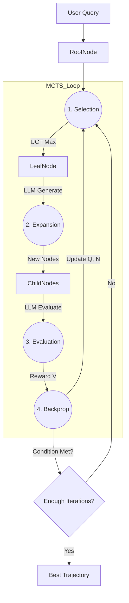

# 第08课：蒙特卡洛树搜索 (MCTS) Agent

**关键词**：MCTS, UCT (Upper Confidence Bound), AlphaZero, RAP (Reasoning via Planning)

---

## 笔记区域


你好。这是《AI Agent 深度架构与数学原理》的第八课。

在前面的课程中，我们从线性的 CoT 讲到了广度/深度优先搜索的 ToT。ToT 的核心问题在于**搜索策略是盲目的（Uninformed）**或仅仅是**贪婪的（Greedy）**。

* BFS (Beam Search) 容易陷入局部最优，且无法回溯。
* DFS 容易钻牛角尖，浪费计算资源在错误的路径上。

**背景驱动**：

* **挑战**：在极复杂的推理任务（如奥数证明、长篇小说规划、复杂代码重构）中，状态空间是指数级爆炸的。我们无法遍历所有状态。
* **突破点**：借用 AlphaGo 的核心引擎——**蒙特卡洛树搜索 (MCTS)**。
* **改进方向**：引入**探索（Exploration）**与**利用（Exploitation）**的平衡机制。不仅仅是评估“当前状态好不好”，还要评估“这个未知分支值得探索的潜力有多大”。

---

# 🧠 第08课：蒙特卡洛树搜索 (MCTS) Agent

### 1. 理论核心：UCB 公式与四步循环

#### 1.1 数学定义：推理作为马尔可夫决策过程 (MDP)

我们将推理过程建模为一个决策树：

* **状态 $s$**：当前生成的思维链轨迹。
* **动作 $a$**：LLM 生成的下一个思维步骤（Thought Step）。
* **策略 $P(a|s)$**：LLM 作为 Policy Network，提供动作的先验概率。
* **价值 $V(s)$**：LLM（或专门的 Reward Model）作为 Value Network，估计当前状态最终成功的概率。

#### 1.2 核心公式：UCT (Upper Confidence Bounds for Trees)

MCTS 的灵魂在于选择节点时使用的 UCT 公式。当我们决定下一步探索哪个节点时，我们要最大化以下分数：

$$
\text{UCT}(s, a) = \underbrace{Q(s, a)}_{\text{Exploitation}} + \underbrace{c_{puct} \cdot P(a|s) \cdot \frac{\sqrt{\sum_b N(s, b)}}{1 + N(s, a)}}_{\text{Exploration}}
$$

* **$Q(s, a)$ (Q-Value)**: 动作 $a$ 在过去模拟中获得的平均价值。代表“经验上这里很好”。
* **$N(s, a)$ (Visit Count)**: 动作 $a$ 被访问的次数。
* **$P(a|s)$ (Prior)**: LLM 生成该动作的原始概率（Log-prob）。
* **Exploration Term (后一项)**: 如果一个节点 $N(s,a)$ 很小（很少被访问），这一项会变大，强迫算法去探索那些“未被涉足但 LLM 认为概率较高”的区域。

#### 1.3 MCTS 四步循环

1. **Selection (选择)**: 从根节点出发，根据 UCT 公式递归选择子节点，直到到达一个叶子节点。
2. **Expansion (扩展)**: 对叶子节点进行扩展，利用 LLM 生成 $k$ 个可能的后续思维 $a_1 \dots a_k$。
3. **Simulation / Evaluation (模拟/评估)**:
   * *Lightweight*: 直接让 LLM 给当前状态打分 $V(s)$。
   * *Heavyweight*: 快速模拟（Rollout）到底，看能否得出正确答案（如通过 Unit Test），反推价值。
4. **Backpropagation (反向传播)**: 将获得的价值 $V$ 和访问次数 $N$ 沿着路径向上传播，更新所有父节点的 $Q$ 和 $N$。

---

### 2. 架构解剖与工程应用

#### 2.1 系统设计图 (Mermaid)



#### 2.2 工程应用：I/O 与 步骤

以 **RAP (Reasoning via Planning)** 为例：

1. **Input**:
   * Query: "证明 $\sqrt{2}$ 是无理数。"
   * Settings: Simulation 次数 $N=50$。
2. **Step 1: Expansion**:
   * LLM 生成第一步的 3 个候选：(A) "假设是有理数...", (B) "计算...", (C) "使用几何..."。
3. **Step 2: Evaluation**:
   * LLM 评分：(A) 0.9, (B) 0.1, (C) 0.5。
4. **Step 3: Loop**:
   * 基于 UCT，算法可能会先深挖 (A)。
   * 如果在 (A) 的后续步骤中发现逻辑矛盾，(A) 的 $Q$ 值下降。
   * UCT 的探索项占优，算法自动转向探索 (C)。
5. **Output**:
   * 输出访问次数 $N$ 最多的那条路径（最鲁棒的路径），而非 $Q$ 值最高的路径（防止偶然的高分）。

---

### 3. Code & Engineering：实现一个 MCTS Solver

这是一个简化的 MCTS 实现，去除了 AlphaGo 中复杂的神经网络推理优化，专注于逻辑结构。

```python
import math
import numpy as np

class MCTSNode:
    def __init__(self, state, parent=None, prior=1.0):
        self.state = state         # 当前思维链内容
        self.parent = parent
        self.children = {}         # Action -> Node
        self.visit_count = 0       # N(s, a)
        self.value_sum = 0.0       # Sum of Q
        self.prior = prior         # P(a|s) from LLM

    @property
    def value(self):
        # Q(s, a) = value_sum / visit_count
        if self.visit_count == 0:
            return 0
        return self.value_sum / self.visit_count

class MCTSAgent:
    def __init__(self, llm_policy, llm_value, c_puct=1.4):
        self.llm_policy = llm_policy # Actor: Generate thoughts
        self.llm_value = llm_value   # Critic: Evaluate state
        self.c_puct = c_puct

    def search(self, initial_state, num_simulations=10):
        root = MCTSNode(state=initial_state)
      
        for _ in range(num_simulations):
            node = root
          
            # 1. Selection
            # 一直下潜直到找到一个未完全扩展的节点
            while node.children and not self._is_terminal(node):
                node = self._select_child(node)
          
            # 2. Expansion
            if not self._is_terminal(node):
                # 获取 LLM 的生成结果和概率
                # actions: List[str], priors: List[float]
                actions, priors = self.llm_policy.generate(node.state)
                for action, prior in zip(actions, priors):
                    if action not in node.children:
                        new_state = node.state + "\n" + action
                        node.children[action] = MCTSNode(new_state, parent=node, prior=prior)
              
                # 刚才扩展了，现在选择其中一个子节点进入 Evaluation
                # 在 AlphaZero 中通常是直接 Eval 当前节点，这里为了简单
                if node.children:
                    node = list(node.children.values())[0]

            # 3. Evaluation
            # 使用 Value Model 估算 V(s)
            value = self.llm_value.evaluate(node.state) # Returns 0.0 to 1.0

            # 4. Backpropagation
            while node is not None:
                node.visit_count += 1
                node.value_sum += value
                node = node.parent
      
        # 返回访问次数最多的路径作为最终答案
        return max(root.children.items(), key=lambda item: item[1].visit_count)[0]

    def _select_child(self, node):
        """ 应用 UCT 公式选择最佳子节点 """
        best_score = -float('inf')
        best_action = None
        best_child = None

        for action, child in node.children.items():
            # UCT Formula
            q_value = child.value
            u_value = self.c_puct * child.prior * \
                      (math.sqrt(node.visit_count) / (1 + child.visit_count))
            score = q_value + u_value

            if score > best_score:
                best_score = score
                best_action = action
                best_child = child
      
        return best_child

    def _is_terminal(self, node):
        # 简单判断是否包含结束符
        return "Final Answer" in node.state

# Mock Interfaces
class MockPolicy:
    def generate(self, state):
        return ["Step A", "Step B"], [0.6, 0.4]

class MockValue:
    def evaluate(self, state):
        return 0.8

# usage
# agent = MCTSAgent(MockPolicy(), MockValue())
# best_action = agent.search("Question: ...")
```

---

### 4. Paper Driven：核心论文与贡献

1. **Hao et al. (EMNLP 2023)**: *Reasoning with Language Model is Planning with World Model (RAP)*.
   * **贡献**：这是将 MCTS 引入 LLM 推理的开山之作。它将 LLM 既作为 World Model（预测下一个状态），也作为 Reward Model（评估状态）。
   * **实验**：在 Blocksworld（积木世界）规划任务中，RAP 达到了 SOTA，远超 CoT。
2. **Zhou et al. (ICLR 2024)**: *Language Agent Tree Search (LATS)*.
   * **核心改进**：将 **Reflexion** 融入 MCTS。
   * **机制**：当 MCTS 搜索到一个失败节点时，不仅反向传播 0 分，还让 LLM 生成一个“反思文本”，作为后续搜索的 Context。这使得 UCT 的 Value 估计不仅基于统计，还基于语义反馈。
3. **AlphaMath (2024 Arxiv)**:
   * **贡献**：在数学领域，使用 Policy 预训练生成 Step，训练一个专门的 **Process Reward Model (PRM)** 作为 MCTS 的 Value Function。

---

### 5. Critical Thinking：批判性分析

MCTS 是目前 Reasoning 能力的天花板架构，但代价巨大。

1. **性能瓶颈 (Latency & Cost)**:

   * **问题**：MCTS 需要生成成百上千个节点。如果每个节点都要调用 GPT-4，解决一道题可能需要 5 美元，且耗时几分钟。这在 Production 中几乎不可用，仅用于离线数据生成或极高价值任务。
   * **解决思路**：**Small Value Model**。Policy 可以用大模型，但 Evaluation（最频繁的操作）应该训练一个小的 BERT 或 Llama-7B 来做。
2. **Value Function 的准确性**:

   * **问题**：LLM 很难给“半成品”打分。例如，证明题做了一半，LLM 很难判断这是否是通往正确证明的路径。如果 $V(s)$ 不准，MCTS 就会退化为随机搜索。
   * **解决思路**：**Process Supervision (PRM)**。OpenAI 的 *Let's Verify Step by Step* 证明了，针对步骤级（Step-level）训练专门的打分模型，比让 LLM 也就是 Prompting 打分要准得多。

---

### 6. 前沿扩展

* **MCTS + Self-Correction (LATS)**:
  标准的 MCTS 遇到死路只是降低 $Q$ 值。LATS 让 Agent 在死路处“贴条子”（生成反思），后续搜索经过这里时，会看到“此路不通，原因是...”，从而更智能地规避。
* **Offline RL -> Online Planning**:
  使用 MCTS 离线生成高质量的推理轨迹（Thought Traces），然后用这些轨迹去微调（SFT）一个小模型。
  这实际上是 **DeepSeek-R1 / OpenAI o1** 等推理模型背后的核心思想：**用搜索即服务（Search as a Service）来蒸馏模型**。

---

### 总结

MCTS Agent 将 LLM 推理变成了一个**概率搜索问题**。它通过显式的探索机制，解决了 CoT 容易陷入局部最优的问题。
虽然目前成本高昂，但它是通向 **System 2 Deep Reasoning** 的必经之路。未来的方向一定是 **“大模型生成 + 小模型评估 + MCTS 搜索”** 的混合架构。

至此，我们的《AI Agent 深度架构》理论与算法部分（从 CoT 到 MCTS）已经完结。
下一课，我们将进入 **Memory & RAG 专题**，探讨如何让这些聪明的 Agent 拥有“过目不忘”的长期记忆。
