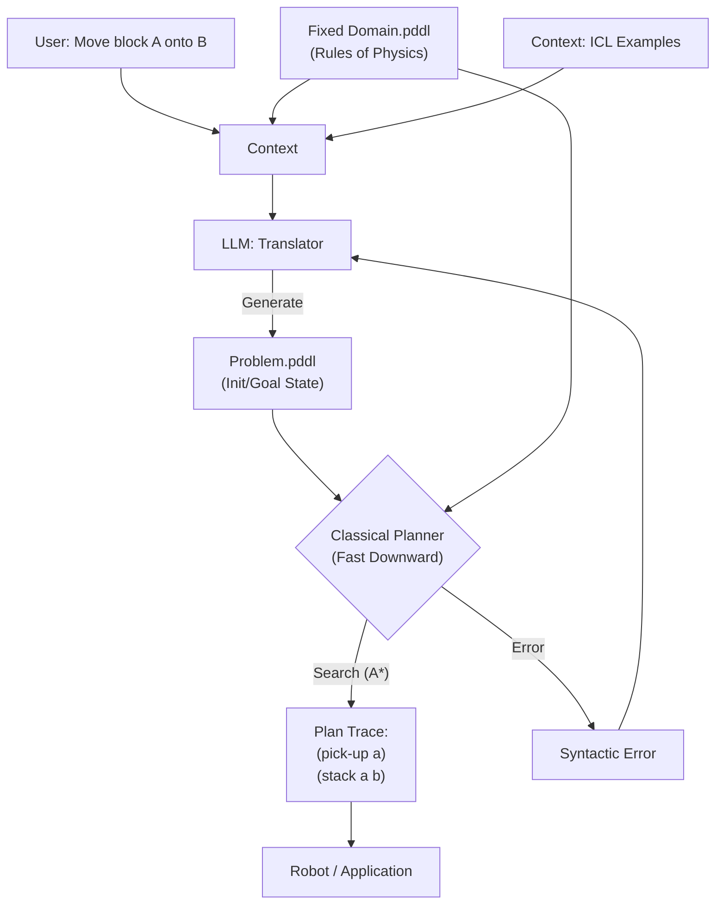

# 第09课：神经符号规划 (LLM+P)

**关键词**：PDDL, Symbolic Planning, Fast-Downward, 长链因果推理

---

## 笔记区域

你好。这是《AI Agent 深度架构与数学原理》的第九课。

在前面的课程（MCTS, ToT）中，我们一直在尝试“强推”LLM 的逻辑推理能力。但无论如何 Prompting，LLM 本质上仍然是一个概率模型，它没有**“硬逻辑（Hard Logic）”**约束。这意味着它在处理长链路、强约束的任务（如物流调度、机器人路径规划）时，随时可能出现“幻觉”——比如让机器人穿墙而过，或者移动一个被压在底下的箱子。

**背景驱动**：

* **挑战 (Challenge)**：LLM 缺乏**物理一致性（Physical Consistency）**和**状态回溯的完备性**。单纯靠 LLM 生成 Plan，无法保证 Plan 的可执行性（Feasibility）和最优性（Optimality）。
* **突破点 (Breakthrough)**：**神经符号人工智能（Neuro-Symbolic AI）**。
  * **Neuro (LLM)**：擅长语义理解、常识推理、将自然语言翻译成形式化语言。
  * **Symbolic (Planner)**：擅长在封闭世界假设下进行完美的逻辑搜索（如 A* 算法）。
* **改进方向**：
  **LLM+P (Large Language Models + Classical Planners)**。将 LLM 从“求解者”降级为“翻译器”，将真正的“求解”工作外包给经典的 AI 规划器（如 Fast Downward）。

---

# 🧠 第09课：神经符号规划 (LLM+P)

### 1. 理论核心：PDDL 与 形式化规划

#### 1.1 问题形式化：STRIPS 规划问题

在经典 AI 中，一个规划问题被形式化为元组 $\Pi = \langle \mathcal{D}, \mathcal{P} \rangle$。

1. **Domain (领域, $\mathcal{D}$)**：定义了世界运作的物理规则。

   * **Predicates (谓词)**：描述状态的原子，例如 `On(x, y)`, `Clear(x)`。
   * **Actions (动作)**：定义为 $\langle \text{Pre}, \text{Add}, \text{Del} \rangle$。

     * Preconditions (前提): 动作执行前必须为真。
     * Effects (Add/Del): 动作执行后状态的改变。
   * *数学表达*：

     $$
     \text{Action}(a): S \to S' \quad \text{iff} \quad \text{Pre}(a) \subseteq S
     $$

     $$
     S' = (S \setminus \text{Del}(a)) \cup \text{Add}(a)
     $$
2. **Problem (问题, $\mathcal{P}$)**：定义了具体的任务实例。

   * **Objects**: 涉及的实体（如 block_a, block_b）。
   * **Init State ($S_0$)**: 初始世界状态。
   * **Goal State ($G$)**: 目标状态逻辑公式。

#### 1.2 LLM+P 的核心假设

LLM 无法直接在大脑中模拟 $S \to S'$ 的精确状态转移（特别是步骤 $N > 10$ 时）。但是，LLM 非常擅长做**语义同构映射（Semantic Isomorphism Mapping）**。

即存在映射函数 $f_\theta$：

$$
f_\theta: \text{Natural Language (NL)} \to \text{PDDL (Planning Domain Definition Language)}
$$

一旦问题被转化为 PDDL，经典的规划器（Planner）可以在毫秒级内保证找到最优解（Optimal Plan）。

---

### 2. 架构解剖与工程应用

#### 2.1 系统流水线 (Pipeline)

LLM+P 的架构是一个典型的**编译器模式（Compiler Pattern）**：

1. **Translation (LLM)**: 将用户的自然语言需求 + 预定义的 Domain 描述 $\to$ 生成 `problem.pddl` 文件。
2. **Planning (Solver)**: 调用外部求解器（如 Fast Downward, Pyperplan） $\to$ 生成 Action Sequence。
3. **Interpretation (LLM)**: 将 PDDL Action Sequence $\to$ 自然语言描述或机器人指令。

#### 2.2 架构图解 (Mermaid)



#### 2.3 工程应用：输入输出详解

**场景**：Robotic Arm Blocksworld (机械臂搭积木)。

* **输入 (Input)**:

  * **Prompt**: 包含 `domain.pddl` 的文本（定义了 pickup, stack, unstack 等操作逻辑），以及几个 NL $\to$ PDDL 的 Few-shot 示例。
  * **User Query**: "There are 3 blocks. Block A is on the table. Block B is on A. Block C is on the table. I want to have A on B, and B on C."
* **模型输出 (LLM Output)**:
  LLM 不需要输出 "First, I pick up B..."，而是输出纯代码：

  ```lisp
  (define (problem blocksworld-prob)
    (:domain blocksworld)
    (:objects a b c)
    (:init (on-table a) (on b a) (on-table c) (clear b) (clear c) (handempty))
    (:goal (and (on a b) (on b c)))
  )
  ```

* **求解器操作**:
  运行 `fast-downward --alias seq-sat-llama problem.pddl`。
  求解器利用启发式搜索（如 $h_{ff}$ 启发式），探索状态空间。
* **最终结果**:

  ```lisp
  (unstack b a)
  (putdown b)
  (pickup a)
  (stack a b)
  (pickup b)
  (stack b c)
  ```

  这是一个**绝对正确**的序列，不可能出现“手中已有物体时再去抓物体”的逻辑错误。

---

### 3. Code & Engineering：实现 LLM+P 桥接器

为了让研三学生理解核心，我们将实现一个 Python 类，它管理 PDDL 的生成并调用轻量级 PDDL 求解器库（`pyperplan` 或模拟接口）。

**关键点**：Prompt 必须强制 LLM 输出严格符合 PDDL 语法的 S-Expression。

```python
import subprocess
import os
from typing import List

class PDDLPlannerAgent:
    def __init__(self, llm_client, domain_pddl_path: str):
        self.llm = llm_client
        # 1. 加载 Domain 定义（物理规则通常是硬编码或专家写好的）
        with open(domain_pddl_path, 'r') as f:
            self.domain_content = f.read()

    def _construct_prompt(self, user_task: str) -> str:
        """
        ICL Prompting: 教 LLM 如何将自然语言转化为 PDDL Problem
        """
        return f"""
        You are an expert in PDDL (Planning Domain Definition Language).
        Given the following domain definition:
        {self.domain_content}

        And these examples:
        User: "Block A is on the table. B is on A."
        PDDL:
        (define (problem p1) (:domain blocksworld) (:objects a b) 
        (:init (on-table a) (on b a) (clear b) (handempty)) (:goal ...))

        Task: Translate this natural language description into a valid PDDL problem.
        User: "{user_task}"
        Output only the code block.
        PDDL:
        """

    def plan(self, user_task: str) -> List[str]:
        # Step 1: LLM Translation
        prompt = self._construct_prompt(user_task)
        problem_pddl_str = self.llm.generate(prompt)
    
        # Save to temporary file
        with open("problem.pddl", "w") as f:
            f.write(problem_pddl_str)

        # Step 2: External Solver Execution
        # 这里假设安装了 fast-downward 或 pyperplan
        # 实际工程中需处理 Solver 的 Stdout/Stderr
        try:
            print(">>> Running Classical Planner...")
            # 模拟 Solver 返回结果
            # process = subprocess.run(["pyperplan", "domain.pddl", "problem.pddl"], capture_output=True)
            # plan_trace = self._parse_solver_output(process.stdout)
            plan_trace = self._mock_solver(problem_pddl_str)
            return plan_trace
        except Exception as e:
            return [f"Planning Failed: {str(e)}"]

    def _mock_solver(self, problem_str):
        # 模拟求解器行为：如果语法正确，返回路径
        if "(:objects" in problem_str and "(:init" in problem_str:
            return ["(unstack b a)", "(putdown b)", "(pickup a)", "(stack a b)"]
        else:
            raise ValueError("Invalid PDDL Syntax generated by LLM")

# --- Usage ---
# domain.pddl 是预先定义好的
# agent = PDDLPlannerAgent(openai_client, "domain.pddl")
# actions = agent.plan("Put Block A on Block B")
# print(actions)
```

---

### 4. Paper Driven：核心论文与贡献

1. **Liu et al. (2023)**: *LLM+P: Empowering Large Language Models with Optimal Planning Proficiency*.
   * **核心贡献**：提出了标准的 LLM+P 范式。
   * **实验结论**：在 Blocksworld 等经典规划 Benchmark 上，单纯 GPT-4 的成功率不足 30%（随步数增加指数下降），而 LLM+P 只要转换正确，成功率接近 100%。证明了“术业有专攻”：LLM 做翻译，Planner 做推理。
2. **Ahn et al. (Google Robotics, 2022)**: *Do As I Can, Not Just As I Say (SayCan)*.
   * **连接点**：虽然不是严格的 PDDL，但 SayCan 引入了 **Affordance (可供性)** 的概念。
   * **公式**：$P(\text{Plan}| \text{User}) \propto P_{\text{LLM}}(\text{Action}|\text{User}) \cdot P_{\text{Value}}(\text{Feasible}|\text{State})$。它将 LLM 的语义概率与机器人的执行成功率结合。
3. **Silver et al. (2022)**: *PDDL planning with Pretrained Large Language Models (Generalized Planning)*.
   * **进阶**：LLM 不仅可以生成 Problem，甚至可以在少样本下生成 Domain PDDL（即**学习物理规则**），虽然目前这仍然非常困难。

---

### 5. Critical Thinking：批判性分析

LLM+P 看起来很美，但有一个巨大的**阿喀琉斯之踵**。

1. **翻译瓶颈 (Translation Bottleneck)**:

   * **局限**：系统的上限取决于 LLM 能否生成**语法完美**且**语义准确**的 PDDL。如果 LLM 漏掉了一个 `(clear a)` 的初始状态，Solver 会直接报错或无解。
   * **解决思路**：引入 **Reflexion** 机制。如果 Solver 报错，将报错信息（如 "Syntax Error at line 5" 或 "Goal unreachable"）喂回给 LLM，让其修正 PDDL 代码。
2. **封闭世界假设 (Closed World Assumption)**:

   * **局限**：PDDL 要求全知全能（God View）。你必须定义所有物体和所有状态。这在现实世界（Open World）中几乎不可能。
   * **解决思路**：**Open-World Planning**。结合 RAG 或 Vision 模型，动态地发现物体并增量更新 PDDL 状态，而不是一次性全量定义。
3. **Domain 编写成本**:

   * **局限**：编写 `domain.pddl` 需要专家知识（Predicate Logic）。
   * **解决思路**：使用 LLM 辅助编写 Domain，或者从 API 文档自动转化为 Tool Domain。

---

### 6. 前沿扩展

* **LLM as PDDL Corrector**:
  不要让 LLM 从零写 PDDL。而是基于一个有噪声的感知输入生成 PDDL，然后利用 LLM 的常识来**修补（Inpaint）**缺失的前提条件。
* **Skill Library (Voyager Style)**:
  将 Solver 生成的成功的 Action Sequence 存入向量数据库。下次遇到类似任务，直接检索这个 Plan 作为 Few-shot，或者直接复用（Skill Reuse），跳过求解过程。

---

### 总结

LLM+P 是一种**神经符号主义（Neuro-Symbolic）**的典型架构。
它教会我们一个架构原则：**不要试图让 LLM 做它不擅长的搜索和逻辑约束问题，而是让它充当自然语言与形式化语言之间的“编译器”。**

下一课，我们将进入 **Agent 微调 (AgentTuning)** 领域，探讨如何通过训练让小模型也能具备强大的规划能力。
